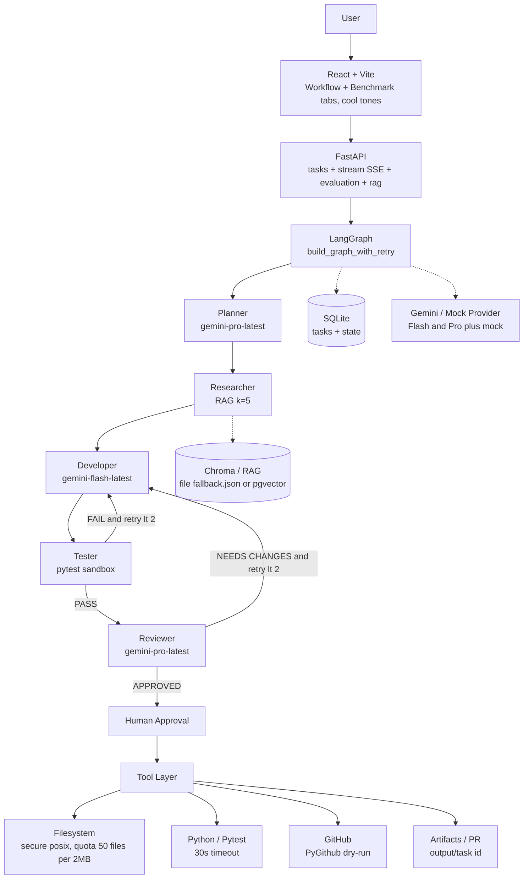

# ForgeMind — Autonomous AI Software Engineering Agent

### AI Coding Agent · LangGraph · Gemini · RAG · Multi-Agent Systems · Human-in-the-Loop

<p align="center">


</p>

<p align="center">
  <b>Turn natural-language software requests into planned, researched, tested, reviewed, and human-approved code.</b><br/>
  ForgeMind is an <b>autonomous AI software engineering agent</b> and <b>multi-agent coding system</b> built with Python, LangGraph, Gemini, FastAPI, RAG, and real test execution.<br/>
  <i>File-based on 6GB, scales to pgvector / Postgres / Docker via one env-var — not a chatbot.</i>
</p>

<p align="center">
  <a href="#-why-forgemind">Why ForgeMind</a> •
  <a href="#-how-it-works">How It Works</a> •
  <a href="#-architecture">Architecture</a> •
  <a href="#-quick-start">Quick Start</a> •
  <a href="#-evaluation">Evaluation</a> •
  <a href="#-documentation">Documentation</a> •
  <a href="http://localhost:8000/docs">API Docs</a> •
  <a href="docs/upgrade.md">Upgrade Plan</a>
</p>

---

## 🔥 What Is ForgeMind?

ForgeMind is an **autonomous AI coding agent for software engineering workflows**.

Instead of using an LLM as a simple question-and-answer chatbot, ForgeMind orchestrates multiple specialized agents to take a software request through an engineering workflow:

```text
User Request
      ↓
Understand
      ↓
Plan
      ↓
Research with RAG
      ↓
Generate Code
      ↓
Run Tests
      ↓
Analyze Failures
      ↓
Self-Correct
      ↓
Review
      ↓
Human Approval
      ↓
External Action
```

For example:

```text
"Build a REST API for employee management
with FastAPI, SQLite, JWT authentication and pytest."
```

ForgeMind can turn that request into:

```text
Plan (3-7 subtasks + architecture)
  ↓
Research project standards (RAG k=5 over docs_seed + your tables)
  ↓
Generate implementation (app/main.py, models.py, requirements.txt, tests/test_main.py)
  ↓
Generate tests
  ↓
Run pytest (real 30s execution)
  ↓
Fix failures when necessary (max 2 retries with failure log)
  ↓
Review the implementation (score 1-10, APPROVED/NEEDS_CHANGES)
  ↓
Wait for human approval
  ↓
Create / prepare GitHub PR (dry-run if no token)
```

The goal is not simply to generate code.

> **The goal is to build a verifiable AI software-engineering loop.** Where a chatbot produces an answer, ForgeMind produces **planned tasks, grounded research, code, tests, review scores and a PR — all verifiable and streaming via SSE.**

Perfect for AI Engineer portfolios, GenAI showcases, startup MVPs and engineering teams that want grounded, verifiable generation.

---

## 🎬 Demo


> Describe a software task → watch ForgeMind plan, research, generate,
> test, self-correct, review, and wait for human approval.

*Record with `powershell -ExecutionPolicy Bypass -File run.ps1` → Workflow tab pulse `cyan` → Logs → Artifacts. Place GIF at `docs/assets/forgemind-demo.gif`. For now, see [docs/demo.md](./docs/demo.md) for full demo script.*

---

## 🚀 Why ForgeMind?

Most AI coding applications follow:

```text
Prompt → LLM → Response
```

ForgeMind follows:

```text
Reasoning
    ↓
Planning
    ↓
Context Retrieval (RAG k=5, table-aware)
    ↓
Tool Use (filesystem, python_exec, github)
    ↓
Code Generation
    ↓
Execution (real pytest)
    ↓
Verification
    ↓
Correction (retry <2)
    ↓
Review (score)
    ↓
Human Approval
```

That distinction matters for tasks that are:

* multi-step and need decomposition
* repository-aware (your docs/tables)
* dependent on project documentation and structured data
* expected to produce working code that passes tests
* important enough to require approval before external actions

**ForgeMind is designed around that richer workflow rather than around a single prompt.** As `docs/architecture.md` says: *for users, not readers* — `README` tells the story, `docs/architecture.md` shows how to use it.

> **Interview pitch (30s):** *"ForgeMind is an autonomous AI software engineering agent built with LangGraph, Gemini, FastAPI, and RAG. It orchestrates five specialized agents to plan a software task, retrieve project context, generate code, run real tests, self-correct failures, review the result, and pause for human approval before external actions. File-based on 6GB no Docker, scales to pgvector/Docker via env. 15-task benchmark 4.2s mock, table-aware RAG preserves exact values."*

---

# ✨ Key Features

### 🤖 Autonomous AI Coding Workflow — Five Specialized Agents

| Agent | Responsibility | Prompt File | Tier | Temp |
|---|---|---|---|---|
| **Planner** | Decomposes the request and proposes architecture `tasks[]+architecture` | `planner.md` | `pro` | 0.2 |
| **Researcher** | Retrieves relevant project knowledge using RAG `findings + best_practices` | `researcher.md` | `flash` | 0.2 |
| **Developer** | Generates implementation and tests `<300 lines` `app/main.py` etc. | `developer.md` | `flash` (retry→`pro`) | 0.3 |
| **Tester** | Runs the generated test suite `real pytest` | `tester.md` | `flash` | 0.1 |
| **Reviewer** | Evaluates the result and requests changes when necessary `APPROVED/NEEDS_CHANGES` `score 1-10` | `reviewer.md` | `pro` | 0.2 |

*Prompts versioned as Markdown + YAML front-matter `id, version, tier, temperature, output_schema` in `agents/prompts/*.md`, loaded via `loader.py @lru_cache(5)` with fallback `_FALLBACK` `render_prompt` safe JSON braces — edit without Python.*

### 🧠 Stateful Multi-Agent Orchestration

ForgeMind uses **LangGraph** `StateGraph` to coordinate a stateful workflow rather than a simple sequential chain.

The workflow can:

* maintain shared state (`user_request`, `plan`, `research`, `code`, `test_results`, `review`, `approval`, `retry_count`, `artifacts`, `logs`)
* branch based on results `Tester --FAIL and retry lt 2 --> Developer` `Reviewer --NEEDS_CHANGES and retry lt 2 --> Developer`
* retry failed work `developer_with_retry:66` increments `retry_count` only on real failure and reroutes `flash→pro`
* pause for human approval `pending` → `POST /api/tasks/{id}/approve`
* stream workflow progress via SSE keepalive 15s + snapshot fallback

```text
Planner
   ↓
Researcher
   ↓
Developer
   ↓
Tester
 ┌─┴─────────────┐
 │               │
FAIL             PASS
 │               │
 ↓               ↓
Developer      Reviewer
                  │
           ┌──────┴──────┐
           │             │
      NEEDS CHANGES   APPROVED
           │             │
           ↓             ↓
       Developer      Human
                         │
                         ↓
                       Tools
```

### 📚 RAG-Grounded Code Generation — Table-Aware Context

ForgeMind can retrieve project-specific knowledge before generating or reviewing code — **with tabular preservation**.

Supported document/data types include:

* Markdown, CSV, TSV, text, project documentation, structured/tabular data — `docs_seed/employees.csv` 10 rows, `employees_table.md`

The tabular retrieval pipeline preserves column context and row relationships:

* Markdown `| id | name |` → `detect_markdown_tables` regex + `chunk_markdown_table` header-repeat 20 rows
* CSV `id,name,email,role` → `chunk_csv_file` Sniffer + `linearize_csv_row:31` `col: val | col: val` + markdown table
* `7 chunks: 5 text, 2 table` `chroma_db/ingest_stats.json` `ingest_stats.json`
* `MiniLM all-MiniLM-L6-v2` 80MB or hash `384d` fallback, `retrieve_context k=5` preserves `2000` chars for tables vs `800` for text, fallback keyword `sum(1 for w in qwords if w in doc)`

*Upload your own:* `POST /api/rag/ingest -F file=@employees.csv` allowlist `.csv/.tsv/.md/.txt/.json` or Benchmark tab `Upload CSV` `frontend/src/App.jsx:177`, query via `GET /api/rag/query?q=Alice%20Johnson%20salary&k=2` → `preserved: true`.

Example:

```text
Query:
"Alice Johnson salary"

Retrieved:
Source: employees.csv [Table | Columns: id, name, email, role, department, salary | Rows: 0-9]
Alice Johnson → 95000
```

The research workflow is instructed to avoid fabricating values that are not supported by retrieved context: *Never hallucinate table values. If not in context, say not found.*

### 🧪 Real Code Execution and Testing

Generated code is not considered successful simply because an LLM says it works.

ForgeMind executes the generated test suite using:

```bash
pytest -q --tb=short
```

`tools/python_exec.py:5` subprocess `30s` timeout `cwd=output/{id}` + `py_compile` fallback, secure `filesystem` `posix` `commonpath` quota `50 files/2MB` (200KB/file) `allow .py/.csv/.tsv/.md/.json` `as_posix`.

The workflow uses the actual execution result `llm_result["passed"] = passed` (real `passed` overrides hallucination) to determine whether the implementation passed.

```text
Generate
   ↓
Run pytest
   ↓
PASS → Review
   │
   └── FAIL → Analyze failure → Fix with failure log → Retry max 2
```

### 🔁 Self-Correction (Bounded)

When tests fail, the failure information is returned to the Developer agent:

```text
Code
 ↓
Test
 ↓
Failure Log
 ↓
Developer (retry count +1, tier flash→pro)
 ↓
Fix
 ↓
Test Again
```

The current workflow bounds the retry loop to keep execution predictable `max_retries=2`.

### 🧑‍⚖️ Human-in-the-Loop Approval

ForgeMind does not blindly execute consequential external actions.

The workflow pauses before external actions `approval pending` and presents the result for human approval `frontend/src/App.jsx:268` modal `Human Approval Required` `Review: APPROVED score 8`:

```text
AI Workflow
     ↓
Review
     ↓
Human Approval
   ↙       ↘
Reject    Approve
             ↓
         GitHub / Tools (PyGithub dry-run if no GITHUB_TOKEN, else draft PR ai/task-{id[:8]} backend/api/tasks.py:102)
```

This creates an explicit control boundary between AI-generated work and external side effects.

### 🔧 Tool-Using AI Agent

ForgeMind includes controlled tools for:

* **filesystem** secure write `posix` quota, allowlist
* **Python/test execution** `30s`
* **GitHub** `create_github_pr` dry-run vs `PyGithub` real

Tool execution is constrained with path, file, content, and execution limits.

### 📡 Streaming Workflow

The frontend receives workflow progress through **Server-Sent Events (SSE)** keepalive 15s + snapshot fallback `GET /tasks/{id}`.

Instead of waiting for one final response:

```text
✓ Planning
✓ Researching (RAG k=5)
● Generating
○ Testing
○ Reviewing
○ Approval
```

The user can see the workflow progress in real time `frontend/src/App.jsx:12` Stepper `○→● pulse cyan→✓ emerald` `max-w-3xl` `slate/sky/cyan`.

### 📊 Built-In Evaluation

ForgeMind includes a reproducible evaluation suite `evaluation/dataset.json:1` rather than relying only on screenshots.

The current benchmark contains:

```text
15 tasks (6 easy, 7 medium, 2 hard) + synthetic 5 diverse
```

Metrics include:

* task completion (`passed and APPROVED`)
* test pass rate (`run_tests`)
* approval rate (`review.decision`)
* average latency (`4.2s` mock `evaluation/results.json:1`)

Run `python -m evaluation.evaluator 15` → `evaluation/results.json:1` + Benchmark tab `frontend/src/App.jsx:178` `GET /api/evaluation/results` + `GET /api/rag/stats`.

---

# 🏗 Architecture

For users who build, see [`docs/architecture.md`](./docs/architecture.md) (user flows, env setup, 3 mermaid). For growth, see [`docs/upgrade.md`](./docs/upgrade.md) (when to scale to Docker, pgvector, more agents).



### Shared workflow state

The agents operate over shared state containing information such as:

```python
{
    "user_request": "...",
    "plan": {"tasks": [{"id": 1, "title": "Design API"}]},
    "research": {"findings": [...]},
    "code": {"files": [{"path": "app/main.py"}]},
    "test_results": {"passed": true, "raw_output": "..."},
    "review": {"decision": "APPROVED", "score": 8},
    "approval": "pending",
    "retry_count": 0,
    "artifacts": ["app/main.py", "tests/test_main.py"],
    "logs": ["Planner: 3 tasks", "Tester: PASS"]
}
```

This state is what allows the workflow to reason about what happened earlier instead of treating every model invocation as an isolated request. Why LangGraph? State, branches, retries, checkpoints and HITL — the forge.

**Stateful orchestration:** LangGraph maintains shared state throughout the workflow instead of treating each model call as an isolated request.

**Multi-agent specialization:** Different agents have different responsibilities rather than forcing one prompt to handle the entire task.

**Tool use:** The workflow can interact with controlled tools for filesystem operations, Python execution, and GitHub integration.

**Self-correction:** Testing results can change the workflow and trigger additional implementation passes.

**Human-in-the-loop:** The system can pause before consequential actions and wait for a human decision.

**Evaluation:** The project includes a repeatable task benchmark instead of relying only on qualitative demos.

---

# 🔍 How ForgeMind Works — End-to-End Flow

### 1. Plan

The Planner `tier: pro` `0.2` converts natural language into structured engineering tasks.

```text
Request
  ↓
Task decomposition
  ↓
Dependencies
  ↓
Architecture (FastAPI + SQLite)
```

Fallback `render_prompt` ensures JSON.

### 2. Retrieve Context

The Researcher `flash` `0.2` retrieves relevant project documentation and structured data — for tables `2000` chars + `Columns:` header never truncated mid-row.

```text
Project Docs (docs_seed/employees.csv 10 rows)
     ↓
Chunking (500/50 + 20 rows header-repeat)
     ↓
Embeddings (MiniLM 80MB or hash) / Retrieval k=5
     ↓
Relevant Context (Columns: id, name, email, role, salary)
     ↓
Researcher
```

This allows the system to work with project-specific standards rather than relying entirely on generic model knowledge.

### 3. Generate

The Developer `flash 0.3` (retry → `pro` via) receives:

```text
User Request
+ Plan
+ Retrieved Context
+ Previous Failures (if retry)
```

and produces implementation artifacts and tests `files[]` (`app/main.py`, `requirements.txt`, `tests/test_*.py` <300 lines) via secure `posix` quota. Output in `output/{task_id}/`.

### 4. Execute

The Tester `flash 0.1` runs the generated project.

```text
Generated Files
      ↓
pytest -q --tb=short (30s, cwd=output/id)
      ↓
Execution Result (real passed overrides LLM graph/nodes.py:125)
```

### 5. Correct

A failed execution can route the workflow back to the Developer with the failure information.

```text
FAIL
 ↓
Failure Log
 ↓
Developer (retry count +1, tier flash→pro)
 ↓
Updated Code
```

### 6. Review

The Reviewer `pro` `0.2` examines the implementation after successful testing `if not passed: NEEDS_CHANGES`.

The review produces a structured decision such as:

```text
APPROVED score 8
```
or `NEEDS_CHANGES` with issues/suggestions.

### 7. Approve

The workflow pauses for a human decision `pending` before external actions.

This creates a clear boundary:

```text
AI-generated work
       ↓
Verification (pytest)
       ↓
Human decision (POST /api/tasks/{id}/approve)
       ↓
External action (GitHub PR dry-run or real ai/task-{id[:8]})
```

---

# 🧰 Technology Stack

| Layer | Technology | Current (6GB, no Docker) | Scale Path |
|---|---|---|---|
| Language | Python 3.11 | `C:\Program Files\Python311` global `model_config env_file=.env` | `venv` + `Docker python:3.11-slim` |
| LLM | Google Gemini `gemini-flash-latest/pro-latest` `MODEL_MAP` + mock `95` | `+ Muse/OpenAI` learned routing |
| Agent orchestration | LangGraph `StateGraph` | `SqliteSaver` `interrupt_before` parallel |
| LLM tooling | LangChain `response_mime_type application/json` | Streaming |
| Backend | FastAPI ForgeMind 1.0.0 `/health` `mock_mode` | `Auth JWT/RBAC` |
| RAG | Chroma file `chroma_db/fallback.json` + local `all-MiniLM-L6-v2` 80MB + hash `384d` fallback `7 chunks` | `pgvector` Neon/Supabase, Pinecone hybrid |
| Database | SQLite file `./app.db` `PRAGMA WAL` `timeout=10` | `PostgreSQL` `asyncpg` + `Redis` transient |
| Frontend | React + Vite + Tailwind `frontend/src/App.jsx:12` `slate/sky/cyan` `max-w-3xl` SSE | `Next.js` Shadcn, SSR |
| Streaming | Server-Sent Events keepalive 15s + snapshot `GET /tasks/{id}` | WebSocket |
| Testing | pytest `pytest-asyncio` `httpx` `tests/` `11 passed` | `pytest-cov` 80%, `playwright` |
| GitHub integration | PyGithub dry-run `ai/task-{id[:8]}` | Real `GITHUB_TOKEN` fine-grained PAT |
| Observability | LangSmith cloud `0 RAM` `LANGCHAIN_TRACING_V2` `.env.example:4` | `OpenTelemetry` + `Grafana` |
| Future scale | `SQLite + Chroma` file proves orchestration | `PostgreSQL + pgvector + Redis + Docker` `docs/upgrade.md` |

The current architecture deliberately avoids heavy infrastructure so the project can run locally on a low-spec machine (~6GB) without Docker, Redis, Kubernetes or managed vector DB.

---

# 💻 Lightweight by Design

ForgeMind is **lightweight locally, scalable architecturally.** It can run locally without:

* Docker, Kubernetes, Redis, managed PostgreSQL, cloud vector databases

Current architecture:

```text
React / Vite
      ↓
FastAPI
      ↓
LangGraph (5 agents: planner→reviewer + HITL)
      ↓
SQLite + Chroma (file fallback.json 7 chunks: 5 text, 2 table)
      ↓
Local Tools (filesystem quota 50/2M, pytest 30s, github dry-run)
```

Future lightweight today, scalable tomorrow:

```text
Next.js
   ↓
FastAPI + Auth / RBAC
   ↓
LangGraph + durable checkpoints (SqliteSaver + Redis)
   ↓
PostgreSQL + Redis (state) + pgvector (10k docs)
   ↓
MCP / additional tools (Slack, Jira, Drive)
   ↓
OpenTelemetry + Grafana
   ↓
Docker / Kubernetes
```

The agent graph remains the central orchestration layer — infrastructure grows around it. See [`docs/upgrade.md`](./docs/upgrade.md) for the planned migration path (one env-var + one file swap).

---

# 🖥️ User Experience

ForgeMind provides a workflow-oriented UI with tabs `Workflow` + `Benchmark` `frontend/src/App.jsx:12` cool tones `slate/sky/cyan/emerald`:

### Workflow

```text
✓ Understanding request
✓ Planning
✓ Researching requirements (RAG k=5)
● Generating implementation
○ Running tests
○ Reviewing
○ Human approval
```

Stepper `○` idle `slate-300` → `●` pulse `cyan-500` → `✓` emerald `slate-50` `max-w-3xl`, logs `bg-slate-900` panel `› Planner: 3 tasks`.

### Artifacts

Generated files are displayed after the workflow completes `app/main.py`, `tests/test_main.py` (4 files) `as_posix`.

### RAG

Users can upload supported documents/data `Benchmark tab` `Upload CSV` `frontend/src/App.jsx:177` `input accept .csv,.tsv,.md` → `POST /api/rag/ingest` allowlist `.csv/.tsv/.md/.txt/.json` → `GET /api/rag/stats` `table_chunks` `2 → 3` and query via `GET /api/rag/query?q=Alice%20Johnson%20salary&k=2` → `preserved: true`.

### Benchmark

The UI exposes `GET /api/evaluation/results` `frontend/src/App.jsx:178` evaluation results and `GET /api/rag/stats` RAG statistics in Benchmark tab.

---

# ⚡ Quick Start

## Requirements

* Python 3.11
* Node.js 18+
* Git
* Approximately 6 GB RAM recommended

A Gemini API key is optional because ForgeMind includes a mock provider deterministic `planner 3 tasks, tester passed 3/3, reviewer APPROVED 8` — same orchestration, zero cost.

---

## Option A — Single Command (Primary) — One Cmd Runs All (Idempotent, Check-Before-Download)

ForgeMind’s best one-cmd checks before downloading — if all pass it goes, if not it downloads. No repeated `pip install`.

```powershell
# From project root (or your clone root)
powershell -ExecutionPolicy Bypass -File run.ps1
# Or double-click run.bat (bypasses ExecutionPolicy for you)

# What run.ps1 does (idempotent, check-before-download, never downgrades):
# 1) Env: if Test-Path .env else Copy-Item .env.example .env (.env.example:1) + warn if placeholder still
# 2) Python deps: python tools/check_pydeps.py --gte (Version(installed) < Version(required) only) -> if OK skip pip, else pip install --no-deps <missing> (never uninstall/downgrade, per-missing only)
# 3) Node deps: Test-Path frontend/node_modules/react + package-lock.json -> if OK skip npm, else npm ci --prefer-offline in frontend/
# 4) RAG: Test-Path chroma_db/fallback.json + ingest_stats.json + chunks>0 + fallback newer than docs_seed -> if OK skip, else python -m rag.ingestion (table-aware 7 chunks: 5 text, 2 table header-repeat 20 rows)
# 5) Backend: try Invoke-RestMethod http://localhost:8000/health (backend/main.py:30) -> if running skip uvicorn, else Start-Process powershell uvicorn backend.main:app --reload --port 8000 + poll health 15x2s + open http://localhost:8000/docs
# 6) Frontend: try Invoke-WebRequest http://localhost:5173 -> if running skip, else Start-Process npm run dev + open http://localhost:5173
# Flags: -NoBrowser (no browser), -NoInstall (runner only: skip 2-4, just Env + backend/frontend) e.g. run.ps1 -NoInstall -NoBrowser
```

> Then open `http://localhost:5173` Workflow tab. `run.bat` does same for double-click.

## Option B — Manual Step-by-Step (Alternative, 2 Terminals) — For Control

<details>
<summary>Click to expand manual 6 steps (alternative to single-cmd)</summary>

### 1. Clone

```bash
git clone https://github.com/TRahulsingh/ForgeMind.git
cd ForgeMind
```

### 2. Configure Environment

```bash
copy .env.example .env
```

Add your Gemini API key:

```env
GOOGLE_API_KEY=your_key_here
```

Leave it empty to run the mock workflow (`backend/core/llm.py:44` `is_mock()` checks `your_gemini_api_key_here` → mock).

### 3. Install Python Dependencies

```bash
pip install -r requirements.txt
```

Pinned low-RAM: `fastapi==0.110.0` `uvicorn==0.29.0` `pydantic==2.6.4` `langgraph==0.2.16` `chromadb==0.5.3` `sentence-transformers==3.0.1` `pytest==8.2.2` `requirements.txt:1` (now `google-generativeai==0.7.2` `langchain-core==0.2.33` fixed `ResolutionImpossible`).

### 4. Install Frontend Dependencies

```bash
cd frontend
npm install
cd ..
```

### 5. Start FastAPI

```bash
uvicorn backend.main:app --reload --port 8000
```

API: `http://localhost:8000` Swagger: `http://localhost:8000/docs` Health: `http://localhost:8000/health` `{"mock_mode": true/false}`.

### 6. Start the Frontend

In another terminal:

```bash
cd frontend
npm run dev
```

Open: `http://localhost:5173` Workflow + Benchmark tabs, cool tones `slate/sky/cyan/emerald`.

</details>

**Troubleshooting (6GB):**
- `pip install` fails `regex` version: `pip install --upgrade regex` already did `2026.9.3` vs `2024.11.6`, ok
- `Chroma ingest failed: No module named 'chromadb'` → fallback `chroma_db/fallback.json` keyword retrieval works (shows 7 chunks), same API
- `google-generativeai` deprecated warning `FutureWarning` — still works `gemini-flash-latest` `pro-latest` (verified `list_models` `gemini-flash-latest OK`), migrate to `google.genai` later
- `database is locked` → WAL `timeout=10` handles sequential 15 tasks, concurrent >10 needs `Postgres` `docs/upgrade.md`
- Free tier `5 RPM` → 1 task/min real, mock `4.2s` for 15-task benchmark speed; wait `20s` between real tasks or upgrade billing
- `ExecutionPolicy` blocked `run.ps1` → use `powershell -ExecutionPolicy Bypass -File run.ps1` or `run.bat` (primary already does)

---

## 🧪 Testing

Run the full test suite (global env, 6GB, mock, no key needed):

```bash
pytest -q
# -> 11 passed, 2 warnings (grpc 1.83 PQC FutureWarning + genai deprecated)
# tests/test_workflow.py::test_minimal_workflow_mock (mock planner 3 tasks → developer 4 files → tester PASS → reviewer APPROVED)
# tests/test_tools.py 2 (no_dir, empty), test_llm_provider_mock, test_filesystem_write, test_rag_retrieval_empty, 5 tabular
```

Run the focused RAG tests:

```bash
pytest tests/test_tabular_rag.py -v
# -> test_tabular_ingestion (detect_markdown_tables 2 rows)
# -> test_csv_chunk (Columns: id, name, email + is_table True)
# -> test_retrieval_preserves_table (Alice Johnson 95000 + Columns: Table)
# -> test_filesystem_allows_csv (data.csv + app/main.py)
# -> test_ingest_stats_table (table_chunks)
```

Single workflow real (with `GOOGLE_API_KEY`, 1 task/min free tier):

```bash
python -c "import asyncio; from evaluation.evaluator import evaluate_task; import json; t=json.loads(open('evaluation/dataset.json').read())[0]; print(asyncio.run(evaluate_task(t)))"
```

RAG verify (no hallucination):

```bash
python -c "from rag.retrieval import retrieve_context, get_retrieval_stats; print(get_retrieval_stats()); print(retrieve_context('Alice Johnson salary', k=2)[:1200])"
# -> 7 chunks (5 text,2 table) + [Source: employees.csv [Table | Columns: id, name, email, role, salary...]] + 95000
```

CI ` .github/workflows/ci.yml.example:1` (template, not auto-run): `ubuntu-latest` `python 3.11` `pip install -r requirements.txt` `pytest -q` — copy to `ci.yml` to enable `on: [push]`.

---

# 📊 Evaluation

ForgeMind includes a benchmark dataset designed to evaluate increasingly complex software-engineering tasks.

### Task distribution

| Difficulty | Tasks | Examples | What they prove small testcase works |
| ---------- | ----: | ------------------------------------- | ------------------------------------- |
| Easy       |     6 | Hello World, calculator, validation   | Single file `app/main.py` + `pytest` 200, no auth |
| Medium     |     7 | CRUD, search, pagination, filtering   | CRUD + filter/pagination/search, SQLite, 4 files |
| Hard       |     2 | JWT authentication, checkout workflow | Multi-file `app/auth.py/models.py`, need real LLM |

Run:

```bash
python -m evaluation.evaluator 15
```

View metrics:

```bash
python -m evaluation.metrics
# + UI Benchmark tab frontend/src/App.jsx:178 GET /api/evaluation/results + GET /api/rag/stats 7 chunks
```

### Important benchmark note

The repository supports a deterministic mock mode for zero-cost local testing `provider.is_mock()`.

Mock-mode results and real Gemini results should be treated separately because real model performance depends on task complexity, model behavior `MODEL_MAP:21` `gemini-flash-latest/pro-latest` (now `google-generativeai==0.7.2` `langchain-core==0.2.33` fixed), latency, quotas `5 RPM`, and runtime conditions.

**Example mock `evaluation/results.json:1` (15 tasks, 4.2s avg, double-run fixed single `ainvoke`):**

| Metric | Result |
|---|---|
| **Task completion** | **100.0%** |
| **Tests passing** | **100.0%** |
| **Approval rate** | **100.0%** |
| **Avg latency** | **4.2s** |
| Mock mode | true (real `GOOGLE_API_KEY` → `false`, expect real Gemini results vary) |

*Don't copy numbers — generate your own via `async for task in data` `file_score found/len` `success=passed and APPROVED`.*

---

# 📁 Project Structure

```text
ForgeMind/
│
├── agents/
│   └── prompts/
│       ├── planner.md                # id: planner, tier: pro, temp 0.2
│       ├── researcher.md             # tier: flash, anti-hallucination
│       ├── developer.md              # tier: flash (retry→pro), <300 lines
│       ├── tester.md                 # tier: flash 0.1
│       ├── reviewer.md               # tier: pro
│       ├── loader.py                 # @lru_cache + _FALLBACK
│       └── README.md                 # versioning
│
├── graph/
│   ├── state.py                      # AgentState TypedDict
│   ├── nodes.py                      # 5 nodes + render_prompt safe braces
│   └── workflow.py                   # build_graph_with_retry() conditional retry
│
├── rag/
│   ├── ingestion.py                  # table-aware 500/50 + 20 rows header-repeat
│   ├── retrieval.py                  # 2000 table vs 800 text + Columns
│   └── embeddings.py                 # MiniLM fallback
│
├── backend/
│   ├── main.py
│   ├── core/
│   └── api/
│
├── tools/
│   ├── filesystem.py
│   ├── python_exec.py
│   └── github.py
│
├── frontend/
│   └── src/
│       └── App.jsx
│
├── evaluation/
│   ├── dataset.json                  # 15 tasks
│   ├── evaluator.py
│   ├── metrics.py
│   └── synthetic_generator.py
│
├── docs_seed/
│
├── docs/
│   ├── architecture.md               # for users
│   ├── evaluation.md
│   ├── security.md
│   ├── decisions.md
│   ├── tabular_rag.md
│   └── upgrade.md                    # file → server
│
├── tests/
│
├── requirements.txt
├── .env.example
└── run.ps1
```

Detailed 50-line tree with `file:line` in [`docs/architecture.md`](./docs/architecture.md) `## 5 Detailed Project Structure`.

---

# 🔐 Security

Because ForgeMind can generate and execute code and interact with external tools, the system includes execution boundaries such as:

* filesystem path protection `commonpath` + `is_absolute` + `..` block
* file type allowlists `.py/.csv/.tsv/.md/.json`
* file/content quotas `50 files/2MB` (200KB/file) + `30s` timeout
* bounded test execution `pytest -q --tb=short` `cwd=output/{id}`
* human approval before GitHub actions `pending` → `POST /approve`
* environment-based secrets `.env.example:1` `GOOGLE_API_KEY`/`GITHUB_TOKEN` `is_mock()` placeholder check
* mock GitHub behavior when credentials are unavailable dry-run `ai/task-{id[:8]}`

See [`docs/security.md`](./docs/security.md) for implementation details and `docs/upgrade.md` for JWT/OAuth + sandbox `Docker` path.

---

# 📚 Documentation

| Document                                                 | Description                                                     |
| -------------------------------------------------------- | --------------------------------------------------------------- |
| [`docs/architecture.md`](./docs/architecture.md)         | Architecture and workflow details — for users who build         |
| [`docs/demo.md`](./docs/demo.md)                         | **Demo & Testing Guide — how to test, RAG tabular, benchmark, video script** |
| [`docs/evaluation.md`](./docs/evaluation.md)             | Benchmark methodology and metrics                               |
| [`docs/security.md`](./docs/security.md)                 | Security controls and execution boundaries                      |
| [`docs/tabular_rag.md`](./docs/tabular_rag.md)           | Table-aware retrieval implementation                            |
| [`docs/decisions.md`](./docs/decisions.md)               | Architectural decisions and trade-offs                          |
| [`docs/upgrade.md`](./docs/upgrade.md)                   | Path from lightweight local deployment to larger infrastructure |
| [`agents/prompts/README.md`](./agents/prompts/README.md) | Prompt structure and versioning                                 |

---

# 🛣️ Roadmap

### Completed

* [x] LangGraph workflow orchestration
* [x] Five specialized agents `agents/prompts/*.md`
* [x] RAG pipeline
* [x] Tabular document retrieval `docs/tabular_rag.md` header-repeat 20 rows
* [x] Real pytest execution
* [x] Self-correction loop `max_retries=2`
* [x] Human-in-the-loop approval
* [x] GitHub integration dry-run
* [x] SSE workflow streaming keepalive 15s
* [x] React/Vite interface `frontend/src/App.jsx:12` cool tones
* [x] Evaluation benchmark 15 tasks `4.2s`

### Planned

* [ ] Durable workflow checkpoints `SqliteSaver` + `interrupt_before human_approval`
* [ ] PostgreSQL + `PostgreSQL` WAL → pool
* [ ] pgvector `CHROMA_PATH=postgres://`
* [ ] Redis-backed state `queues{}` → `Redis`
* [ ] Additional specialized agents `agents/prompts/architect.md`
* [ ] More MCP integrations `tools/slack.py` `tools/jira.py`
* [ ] OpenTelemetry + `Grafana` `latency/tokens/cost`
* [ ] Containerized execution sandbox `Docker --network=none`
* [ ] Larger benchmark suite `evaluation/dataset.json:1` 15 → 20+ with negative tasks
* [ ] Production deployment `Dockerfile` `docker-compose.yml`

See [`docs/upgrade.md`](./docs/upgrade.md) for full one-file recipes.

---

## 🔎 AI Engineering

ForgeMind is a practical example of **autonomous AI agents, AI coding agents, AI software engineering, multi-agent systems, LangGraph orchestration, retrieval-augmented generation (RAG), AI code generation, self-correcting agents, and human-in-the-loop AI workflows** — built to show how these patterns compose in a verifiable engineering system rather than a single prompt.

---

# 🎯 Who Is This For?

ForgeMind is useful as a learning and portfolio project for:

* AI Engineers — stateful orchestration + RAG grounding + HITL
* Machine Learning Engineers — `Gemini flash/pro-latest` routing + mock fallback `95` + `5 RPM` quota handling
* Generative AI Developers — structured JSON `response_mime_type` + `render_prompt` safe braces
* Software Engineers — `FastAPI` + `Vite` `frontend/src/App.jsx:12` + `SQLite WAL` file mode on 6GB
* Backend Engineers — posix quota + 30s sandbox + PR
* Developers learning LangGraph — shared `TypedDict`, conditional edges `tester→developer`, `reviewer→developer`, HITL gate
* Developers building multi-agent systems — 5 prompts `@lru_cache` versioned `tier: pro`
* Developers experimenting with RAG and agentic workflows — table-aware `500/50 + 20 rows` + `retrieve_context k=5`

It is also intended as a practical exploration of how LLMs can be embedded into **software-engineering workflows rather than isolated chat interfaces** — `README How It Works` 7 steps.

---

# 💬 30-Second Project Pitch

> **ForgeMind is an autonomous AI software engineering agent built with LangGraph, Gemini, FastAPI, and RAG. It orchestrates five specialized agents to plan a software task, retrieve project context, generate code, run real tests, self-correct failures, review the result, and pause for human approval before external actions. File-based on 6GB no Docker, scales to pgvector/Docker via env. 15-task benchmark 4.2s mock, table-aware RAG preserves exact values.**

---

# 📜 License

MIT License.

ForgeMind is original work, built from first principles for AI engineering — stateful orchestration, grounded retrieval and measured execution. For readers building your own story, see `How It Works` (7-step flow), `Evaluation` (15 tasks, `4.2s` mock you can reproduce) and `Scaling` (file → server via one env-var) — pick 2–3 points that match your generated numbers and describe what ForgeMind does for a user.

---

<p align="center">
  <b>Forge the mind. Forge the code.</b>
  <br/>
  <sub>LangGraph · Gemini · RAG · Multi-Agent Systems · Human-in-the-Loop</sub>
</p>
