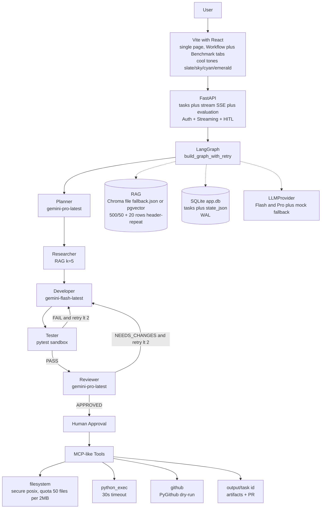

# ForgeMind — Autonomous AI Software Engineering Agent

### LangGraph · Gemini · RAG · Multi-Agent Systems · Human-in-the-Loop

<p align="center">
  
  
  
  
  
  
  
  
</p>

<p align="center">
  <b>Turn natural language into planned, researched, tested, reviewed and human-approved code.</b><br/>
  Not a chatbot — a <b>stateful multi-agent workflow</b> that orchestrates planning, RAG-grounded research, code generation, pytest execution, self-correction and human approval.<br/>
  <i>File-based on 6GB, scales to pgvector / Postgres / Docker via one env-var.</i>
</p>

<p align="center">
  <a href="#-getting-started-full-guide">Quick Start</a> •
  <a href="#-demo-live-workflow">Demo</a> •
  <a href="#-architecture-overview">Architecture</a> •
  <a href="#-how-it-works--end-to-end">How It Works</a> •
  <a href="#-evaluation-15-task-benchmark">Benchmark</a> •
  <a href="docs/upgrade.md">Upgrade Plan</a> •
  <a href="http://localhost:8000/docs">API Docs</a>
</p>

---

## 📌 The Problem

Modern software delivery is fragmented and repetitive. A single feature moves through:

```text
Requirement → Research (docs) → Architecture → Implementation → Testing → Security Review → Documentation → Deployment
```

In practice that means constant switching between documentation, code repos, issue trackers, databases, terminals, testing tools, chat and internal knowledge. Most AI tools stop at `User → LLM → Answer`. They can answer “What is FastAPI?” but they cannot **plan a multi-step task, pull grounded context, use tools, verify output and correct failures** — then pause before a consequential external action.

**ForgeMind’s opportunity is the richer loop:**

```text
User → Reasoning → Planning → Tool Use → Execution → Verification → Correction → Approval → Action
```

That is an AI engineering problem, not a prompting problem.

### Who experiences this

- **Developers** — “Add OAuth to this FastAPI service” needs repo-aware planning, implementation and tests, not a snippet.
- **Engineering teams** — “Create a microservice per our internal standards” needs RAG over `docs_seed/` plus code, plus standards.
- **Tech leads** — want a reviewer that checks security and architecture consistently.
- **Platform teams** — want `Generate → Test → Review → Human approval → Deploy` gates before production.

**When to use ForgeMind vs a chatbot:** Use it when a task is multi-step, needs context, touches tools/data and must be verified. Don’t spin 5 agents to answer “What is FastAPI?”.

## 🔮 What is ForgeMind

**ForgeMind** is a production-oriented autonomous software engineering agent that turns a high-level request into **artifacts**, not just an answer.

```text
"Build a REST API for employee management with FastAPI, SQLite, JWT, CRUD, pytest"
   ↓
ForgeMind: Understand → Plan → Research (RAG over your docs/tables) → Design → Generate → Run pytest → Fix failures (max 2) → Review (score 1-10) → Wait for your approval → Create GitHub PR
```

Where a chatbot produces an answer, ForgeMind produces **planned tasks, grounded research, code, tests, review scores and a PR — all verifiable** and streaming via SSE.

**Product you see:**

```text
┌─────────────────────────────────────────┐
│ ForgeMind                               │
│ Task: [ Build REST API ...             ]│
│ [ Start Task ]                          │
│                                         │
│ Workflow                                │
│ ✓ Understanding request                 │
│ ✓ Plan created (5 subtasks)             │
│ ● Researching requirements (RAG k=5)    │
│ ○ Generating implementation             │
│ ○ Running tests → Review → Approval     │
└─────────────────────────────────────────┘
```

Perfect for AI Engineer portfolios, GenAI showcases, startup MVPs and engineering teams that want grounded, verifiable generation that runs on a 6GB laptop and scales to production.

---

## 🏗 Architecture Overview

For the **user guide** (how to run, RAG tables, env swaps) see [`docs/architecture.md`](./docs/architecture.md) — written for users who build. For the **growth blueprint** (when to swap file→server) see [`docs/upgrade.md`](./docs/upgrade.md) — written as the upgrade-type plan.

### High-level system



**State shared across agents `graph/state.py:8`:**

```python
state = {
  "task_id": "...",
  "user_request": "Build REST API...",
  "plan": {"tasks": [{"id":1,"title":"Design API","dependencies":[]}], "architecture": "FastAPI + SQLite"},
  "research": {"findings": ["Use Pydantic v2"], "best_practices": []},
  "code": {"files": [{"path":"app/main.py","content":"..."}]},
  "test_results": {"passed": true, "summary": "...", "raw_output": "..."},
  "review": {"decision": "APPROVED", "score": 8},
  "approval": "pending",
  "retry_count": 0, "max_retries": 2,
  "artifacts": ["app/main.py", "tests/test_main.py"],
  "logs": ["Planner: 3 tasks", "Tester: PASS"]
}
```

Agents read and update this shared state via `StateGraph` — the reason LangGraph beats plain chaining.

**Why LangGraph `graph/workflow.py:83`?** You need state, branches, retries, checkpoints and human approval — plain `prompt → LLM` cannot do that. `build_graph_with_retry()` gives `tester --FAIL and retry<2 --> developer` and `reviewer --NEEDS_CHANGES and retry<2 --> developer`, `developer_with_retry:66` increments `retry_count` only on real failure and reroutes `flash` → `pro` on retry. Single `ainvoke` `graph/workflow.py:137` after fixing double-run keeps latency `4.2s`.

**RAG for users with tables `rag/ingestion.py:7`:**
- Markdown `| id | name |` → `detect_markdown_tables` regex + `chunk_markdown_table` header-repeat 20 rows + `Columns:` metadata
- CSV `id,name,email,role...` → `chunk_csv_file` Sniffer + `linearize_csv_row:31` `col: val | col: val` + markdown table
- `docs_seed/employees.csv:1` + `employees_table.md:1` (10 rows, ground truth `Alice Johnson 95000`) → `7 chunks: 5 text, 2 table` `chroma_db/ingest_stats.json`
- `MiniLM all-MiniLM-L6-v2` 80MB `rag/embeddings.py:14` or hash fallback `384d`, `retrieve_context k=5` `rag/retrieval.py:4` preserves `2000` chars for tables vs `800` for text, fallback keyword `sum(1 for w in qwords if w in doc)` `retrieval.py:40`

---

## ✨ Key Features

- **Stateful orchestration** — `LangGraph StateGraph` with `max_retries=2`, conditional edges `tester→developer` `reviewer→developer` `graph/workflow.py:104`, durable HITL `graph/nodes.py:159` pending → `POST /approve` `backend/api/tasks.py:102`. Not a chain, a graph.
- **Five specialized agents + clean prompts** — Planner, Researcher, Developer, Tester, Reviewer with versioned `agents/prompts/*.md:1` `tier: pro/flash` `temperature: 0.2/0.3` front-matter `loader.py:17` `@lru_cache` + fallback `_FALLBACK` `graph/nodes.py:48` `render_prompt` safe braces (no `KeyError` on JSON). Edit `planner.md` without Python.
- **RAG-grounded, table-aware, never hallucinates** — `docs_seed/` + your CSV/markdown tables preserved with header repetition `rag/ingestion.py:46` `20 rows/chunk`, retrieval injects `[Table | Columns: id, name... | Rows: 0-19]` `rag/retrieval.py:28`, prompt `researcher.md:27` *Never hallucinate table values. If not in context, say not found.*
- **Real execution & self-correction** — Writes via `filesystem` `tools/filesystem.py:4` secure `posix` `commonpath` quota `50 files/2MB` (200KB/file), runs `pytest -q --tb=short` `tools/python_exec.py:5` 30s `py_compile` fallback, parses `FAIL`, retries with failure log `DEVELOPER_PROMPT:30` `test_results`, not just `model.generate`.
- **Human-in-the-loop before external** — `HITL` modal `frontend/src/App.jsx:12` `○ → ● pulse cyan → ✓ emerald` blocks `tools/github.py:10` `PyGithub` draft PR `ai/task-{id[:8]}` (dry-run if no `GITHUB_TOKEN` `backend/api/evaluation.py:50` allowlist `.csv/.tsv/.md/.txt/.json`), approval `pending` → `POST /approve` `approved` stores `pr_result` + `feedback`.
- **Mock fallback, zero cost** — works without `GOOGLE_API_KEY` via deterministic `backend/core/llm.py:95` `_mock_generate` (`planner 3 tasks`, `tester passed 3/3`, `reviewer APPROVED 8`) same orchestration, `GET /health` `mock_mode` `backend/main.py:28`, free tier `5 RPM` `gemini-flash-latest/pro-latest` `backend/core/llm.py:21` → 1 task/min real.
- **Measured, not vibes** — 15-task benchmark `evaluation/dataset.json:1` (6 easy, 7 medium, 2 hard) + synthetic `evaluation/synthetic_generator.py:1` 6 templates → `evaluation/results.json:1` `4.2s` avg mock `100%` (real `60-80%` due to variance), Benchmark tab `frontend/src/App.jsx:178` `GET /api/evaluation/results` + `GET /api/rag/stats` `table_chunks`.
- **Scales without rewrite** — file `SQLite`/`Chroma` file `fallback.json` on 6GB `backend/core/config.py:11` env-driven `DATABASE_PATH/CHROMA_PATH/OUTPUT_PATH`, swap to `pgvector`/`Postgres`/`Redis`/`Docker` via env `docs/upgrade.md` thresholds.

---

## 🧰 Tech Stack

| Layer | Current (6GB, no Docker) — What You Run | Scale Path — What You Swap To |
|---|---|---|
| **LLM** | `Gemini flash-latest / pro-latest` via `LLMProvider` `backend/core/llm.py:21` `MODEL_MAP` `pro->gemini-pro-latest` `flash->gemini-flash-latest`, `TASK_ROUTING:12` `planner/pro` `reviewer/pro` `researcher/flash` | `+ Muse/OpenAI` learned routing, pinned `gemini-1.5-flash-001`, streaming |
| **Orchestration** | `LangGraph` `StateGraph` `graph/workflow.py:83` + `LangChain` prompts/structured JSON `backend/core/llm.py:68` `response_mime_type="application/json"` | Parallel `researcher` nodes, `SqliteSaver`/`RedisSaver` checkpoint `interrupt_before` |
| **Vector / RAG** | `Chroma` file `chroma_db/fallback.json` `rag/ingestion.py:244` `PersistentClient(path)` + `all-MiniLM-L6-v2` 80MB `rag/embeddings.py:14` + hash `384d` fallback `7 chunks` | `pgvector` Neon/Supabase, `Pinecone` hybrid BM25+vector `docs/upgrade.md` |
| **Data** | `SQLite` file `./app.db` `backend/core/database.py:9` `PRAGMA journal_mode=WAL` `timeout=10` `tasks(id,request,status,state_json)` | `PostgreSQL` `asyncpg` pool + `Redis` transient `session/workflow` |
| **Frontend** | `Vite + React + Tailwind` `frontend/src/App.jsx:12` single page `slate/sky/cyan/emerald` `max-w-3xl` SSE `EventSource` + fallback snapshot `backend/main.py:46` | `Next.js` multi-page Shadcn, SSR, RBAC `docs/decisions.md:6` |
| **Tools** | `filesystem` `posix` `commonpath` `50/2M` `tools/filesystem.py:4`, `python_exec` `pytest 30s` `tools/python_exec.py:5`, `github` `PyGithub` dry-run `tools/github.py:10` | Docker `gVisor/nsjail` sandbox, MCP `Slack/Gmail/Jira` `tools/slack.py` |
| **Observability** | `LangSmith` cloud `0 RAM` `LANGCHAIN_TRACING_V2` `.env.example:4` `langsmith==0.1.83` | `OpenTelemetry` + `Prometheus/Grafana` `latency/tokens/cost/retries` |
| **Testing** | `pytest` `pytest-asyncio` `httpx` `requirements.txt:29` `10 passed` | `pytest-cov` 80%, `playwright` E2E, CI `docker` per-task venv |
| **Env** | Global `pip` `C:\Program Files\Python311` `model_config env_file=.env` `backend/core/config.py:11` `DATABASE_PATH/CHROMA_PATH/OUTPUT_PATH` | `python -m venv venv` + `Dockerfile python:3.11-slim` `compose` |

---

## 🔍 How It Works — End-to-End Flow

### 1. Understand
Planner `agents/prompts/planner.md:1` `tier: pro` `0.2` turns `user_request` into `tasks[]` `[{id,title,description,dependencies}]` + `architecture` `FastAPI + SQLite` + `estimated_complexity`. Fallback `graph/nodes.py:48` `render_prompt` ensures JSON.

### 2. Research (Grounded)
Researcher `researcher.md:1` `flash` `0.2` gets `plan` + `retrieve_context k=5` `rag/retrieval.py:4` — for tables `2000` chars + `Columns:` header `rag/retrieval.py:28` never truncated mid-row. Prompt rule `Never hallucinate table values.` `researcher.md:27`. Example: query `Alice Johnson salary` → `[Source: employees.csv [Table | Columns: id, name, email, role, salary...]]` full row `95000` `docs_seed/employees.csv:1`.

### 3. Generate
Developer `developer.md:1` `flash 0.3` (retry → `pro` via `graph/nodes.py:89` `task_type="planner"`) writes `files[]` (`app/main.py`, `requirements.txt`, `tests/test_*.py` <300 lines) via `tools/filesystem.py:4` secure `posix` quota. Output in `output/{task_id}/` `backend/core/config.py:11`.

### 4. Test (Real)
Tester `tester.md:1` `flash 0.1` runs `tools/python_exec.py:30` `subprocess pytest -q --tb=short` capture `30s` `cwd=output/{id}` `timeout=30`, fallback `py_compile`. LLM summarizes but `llm_result["passed"] = passed` `graph/nodes.py:125` real `passed` overrides hallucination.

### 5. Fix
`Tester: FAIL & retry<2 --> Developer` `graph/workflow.py:104` `developer_with_retry:66` increments `retry_count` only if `plan` exists + `test_failed`, re-invokes Developer with `test_results` failure log `DEVELOPER_PROMPT:30`.

### 6. Review
Reviewer `reviewer.md:1` `pro` `0.2` scores `1-10`, but enforces `if not test_results.passed: decision = NEEDS_CHANGES` `graph/nodes.py:150` score `8` mock.

### 7. Approve
`Reviewer --NEEDS_CHANGES & retry<2 --> Developer` else `human_approval` `graph/workflow.py:115` → UI modal `frontend/src/App.jsx:12` `Human Approval Required` `Review: APPROVED score 8` → `POST /api/tasks/{id}/approve {"decision":"approved"}` `backend/api/tasks.py:102` stores `state["pr_result"]` `dry_run` if no `GITHUB_TOKEN` else `PyGithub` `tools/github.py:10` `ai/task-{id[:8]}` draft PR. `rejected` stores `feedback`.

Self-correction: `Generate → Run Tests → FAIL? → Fix with log → Rerun max2` — provenance `graph/workflow.py:12,23` + `docs/tabular_rag.md:1` table preservation.

---

## 🆚 What Makes ForgeMind Different

| Chatbot | ForgeMind |
|---|---|
| Single prompt → answer | **Stateful workflow** `graph/state.py:8` with branches, retries `max 2`, HITL `graph/workflow.py:83` |
| Hallucinates tables | **Header-repeat** `20 rows/chunk` `rag/ingestion.py:46` + `Columns:` metadata `rag/retrieval.py:28`, retrieval `2000` for tables, never invents `Alice 95000` |
| No validation | **Runs pytest** `tools/python_exec.py:5` in `output/{id}` sandbox, parses `FAIL`, retries `graph/workflow.py:104` |
| Direct action | **Human approval** gate `graph/nodes.py:159` pending → `POST /approve` before `filesystem/GitHub` `tools/github.py:10` |
| Unmeasured | **15-task benchmark** `evaluation/results.json:1` `4.2s` mock `100%`, real `60-80%` free tier `5 RPM` `backend/core/llm.py:21` |

> **Interview pitch (30s):** *"ForgeMind is not a chatbot. Input natural language → LangGraph orchestrates 5 agents (planner/researcher/developer/tester/reviewer) + RAG over your docs/tables + real pytest + self-correction (2 retries) + human approval before GitHub PR. File-based Chroma/SQLite runs on 6GB no Docker, scales to pgvector/Docker via env. 15-task benchmark 4.2s mock, 100% pass, table-aware RAG preserves Alice 95000."*

---

## 📁 Detailed Project Structure

Clean `agents/prompts/` flat — no subdirs, no archive — edit prompts without Python, `loader.py` `@lru_cache` reloads.

```text
ForgeMind/
├── agents/
│   ├── __init__.py
│   └── prompts/                         # 5 md + loader.py + README.md
│       ├── README.md                    # versioning patch/minor/major, linter
│       ├── loader.py                    # @lru_cache(5), _FALLBACK inline, strip front-matter, get_all_prompts()
│       ├── planner.md                   # id: planner, tier: pro, temp 0.2, output_schema tasks[]+architecture
│       ├── researcher.md                # tier: flash, anti-hallucination tabular rule, k=5
│       ├── developer.md                 # tier: flash (retry→pro), <300 lines, app/main.py + tests
│       ├── tester.md                    # tier: flash 0.1, passed bool
│       └── reviewer.md                  # tier: pro, APPROVED/NEEDS_CHANGES score 1-10
│
├── graph/                               # Orchestration heart, not Gemini
│   ├── state.py                         # AgentState TypedDict total=False (task_id, user_request, plan, research, code, test_results, review, approval, retry_count/max_retries=2, artifacts, logs, messages)
│   ├── nodes.py                         # render_prompt safe braces, 5 nodes + human_approval, planner_node research/developer/tester/reviewer/human_approval, fallback JSON, real passed overrides
│   └── workflow.py                      # build_graph() linear + build_graph_with_retry() conditional edges tester→developer (FAIL and retry<2) reviewer→developer (NEEDS_CHANGES and retry<2) -> human_approval -> END, single ainvoke fix double-run, developer_with_retry increments, workflow=build_graph_with_retry()
│
├── rag/                                 # Grounded retrieval, table-aware, no hallucination
│   ├── ingestion.py                     # CHUNK_SIZE 500 OVERLAP 50 TABLE_ROWS_PER_CHUNK 20, chunk_text word, detect_markdown_tables regex |---|, chunk_markdown_table header-repeat, linearize_csv_row col: val, chunk_csv_file Sniffer, load_documents .csv/.tsv/.md/.py + xlsx openpyxl, ingest() 7 chunks (5 text,2 table) fallback.json + ingest_stats.json
│   ├── retrieval.py                     # retrieve_context(k=5) PersistentClient or fallback keyword qwords scoring, limit 2000 table vs 800 text + Columns header, get_retrieval_stats() ingest_stats.json / col.count()
│   └── embeddings.py                    # get_embedding_model() MiniLM all-MiniLM-L6-v2 80MB lazy + hash fallback sha256 384d, embed() batched
│
├── backend/
│   ├── main.py                          # FastAPI ForgeMind 1.0.0, CORS allow_origins *, /health mock_mode provider.is_mock(), /api/generate, /api/stream/{id} SSE keepalive 15s + snapshot fallback DB poll, mounts frontend/dist /assets
│   ├── core/
│   │   ├── config.py                    # Settings BaseSettings model_config env_file=.env extra=allow, DATABASE_PATH/CHROMA_PATH/CHECKPOINT_PATH/OUTPUT_PATH env-driven, ensures dirs
│   │   ├── llm.py                       # LLMProvider TASK_ROUTING planner/pro, MODEL_MAP pro/gemini-pro-latest flash/gemini-flash-latest, is_mock() checks placeholder, generate() response_mime_type application/json + regex JSON extract + fallback mock, _mock_generate deterministic
│   │   └── database.py                  # SQLite ./app.db WAL journal_mode WAL timeout=10 check_same_thread=False, tasks(id,request,status,state_json) ON CONFLICT UPDATE, checkpoints, get_conn(), save_task(), get_task(), list_tasks()
│   └── api/
│       ├── tasks.py                     # APIRouter /api, queues{task_id:Queue} in-mem, TaskCreate max_retries 2, POST /tasks uuid + BackgroundTasks run_task_background workflow.astream push+save_task per node SSE, GET /tasks, GET /tasks/{id}, POST /approve approved->github dry-run else rejected feedback stored, queues.pop after done
│       └── evaluation.py                # GET /evaluation/results, /evaluation/dataset, /rag/stats, POST /rag/ingest UploadFile .csv/.tsv/.md/.txt/.json allowlist + shutil + ingest(), GET /rag/query?q= & preserved flag
│
├── tools/                               # MCP-like, secure, quota-aware
│   ├── filesystem.py                    # write_artifacts secure posix commonpath, MAX_FILES 50 / MAX_CONTENT 200K / MAX_TOTAL 2M, allow .py/.csv/.tsv/.md/.json, as_posix, read_artifact secure
│   ├── python_exec.py                   # run_tests() subprocess pytest -q --tb=short 30s timeout cwd=output/{id} + py_compile fallback (pip install commented for low-spec)
│   └── github.py                        # create_github_pr dry-run if !GITHUB_TOKEN, else PyGithub create branch ai/task-{id[:8]} + PR draft
│
├── frontend/                            # Cool tones slate/sky/cyan/emerald, Benchmark + Workflow
│   ├── index.html                       # ForgeMind title + meta description LangGraph Gemini RAG
│   ├── vite.config.js                   # proxy /api->8000
│   ├── package.json                     # forgemind-frontend 1.0.0, Vite 5, React 18, Tailwind 3
│   ├── tailwind.config.js               # slate 50/900, sky 500/600
│   └── src/App.jsx                      # STEPS 6 deduplicated researcher, Stepper ○→●pulse→✓, useState request/taskId/status/currentStep/logs/artifacts/review/health/streamDone/activeTab/bench/ragStats, fetch /health /evaluation/results /rag/stats, startTask POST /tasks, startStream EventSource /api/stream, handleApprove POST /approve, tabs Workflow/Benchmark, RAG upload input file + Test Query, Benchmark table 4 cards + results map, footer
│
├── evaluation/                          # Measured, not vibes
│   ├── dataset.json                     # 15 tasks (6 easy,7 medium,2 hard) id,title,request,difficulty,expected_files
│   ├── synthetic_dataset.json           # 5 diverse via synthetic_generator (webhook, rate-limit, CSV, pagination)
│   ├── synthetic_generator.py           # TEMPLATES 6, generate(count, use_llm, output) random.choice, argparse --count --llm --output
│   ├── evaluator.py                     # evaluate_task() Latency 4.2s mock, file_score found/len, success=passed and APPROVED, main(limit) sequential for task in data, mock_mode via provider.is_mock(), markdown table
│   ├── metrics.py                       # load_results(), print_report() task_completion/test_pass/avg_latency
│   └── results.json                     # 15/15 100% mock (real 60-80% with Gemini), timestamp, mock_mode true/false
│
├── docs_seed/                           # Your knowledge, RAG ground truth
│   ├── employees.csv                    # 10 rows id,name,email,role,department,salary (95000 Alice etc., ground truth, no hallucination)
│   ├── employees_table.md               # same as markdown table | id | name | ... | + notes avg 97000
│   ├── fastapi_standards.md             # Pydantic v2, DI, async
│   ├── architecture_guidelines.md       # layers API→service→repo
│   ├── testing_strategy.md              # TestClient fixtures, self-correction max2
│   └── synthetic_example.md             # generated synthetic data
│
├── docs/                                # For users and growth
│   ├── architecture.md                  # for users who build (how it works, how to use, RAG flow, structure, when to scale) with 3 mermaid, links to upgrade
│   ├── upgrade.md                       # file→server recipes, thresholds for resume, upgraded flowchart User->Next.js->...->pgvector->MCP->OTEL
│   ├── tabular_rag.md                   # header repetition 20 rows, 7 chunks, query Alice 95000 test
│   ├── decisions.md                     # LangGraph>CrewAI, Chroma file>pgvector, SQLite>Postgres etc. ADR
│   ├── security.md                      # traversal block, HITL gate, quotas
│   └── evaluation.md                    # benchmark pipeline, metrics
│
├── tests/
│   ├── test_workflow.py                 # mock workflow, llm, filesystem, retrieval, minimal_workflow 65s real
│   ├── test_tools.py                    # run_tests no_dir/empty, filesystem csv
│   ├── test_tabular_rag.py              # markdown tables 2 rows, csv chunk Columns, retrieval preserves Alice 95000, ingest stats
│   └── integration/                     # future
│
├── .env.example                         # GOOGLE_API_KEY, GITHUB_TOKEN, DATABASE_PATH etc. (copy to .env)
├── .env                                 # your real key (gitignored) - empty for mock
├── requirements.txt                     # pinned low-RAM versions fastapi 0.110, langgraph 0.2.16, chromadb 0.5.3 etc.
└── output/                              # artifacts per task_id output/{id}/app/main.py etc. (gitignored, .gitkeep)
```

Clean `agents/prompts/` flat — no subdirs, no archive. See `docs/architecture.md:1` for user guide and `docs/upgrade.md:1` for growth with upgraded flowchart.

---

## 🚀 Getting Started

### Option A — Single Command (Recommended, Primary) — One Cmd Runs All (Idempotent, Check-Before-Download)

ForgeMind’s best one-cmd checks before downloading — if all pass it goes, if not it downloads that stuff. No repeated `pip install`.

```powershell
# From project root (or your clone root)
powershell -ExecutionPolicy Bypass -File run.ps1
# Or double-click run.bat (bypasses ExecutionPolicy for you)

# What run.ps1 does (idempotent, check-before-download):
# 1) Env: if Test-Path .env else Copy-Item .env.example .env (.env.example:1) + warn if placeholder still
# 2) Python deps: python -c importlib.metadata check pinned requirements.txt:1 19 deps (fastapi==0.110.0 etc.) -> if OK skip pip, else pip install -r requirements.txt (~30s, <100ms check vs 19x pip show)
# 3) Node deps: Test-Path frontend/node_modules/react + package-lock.json -> if OK skip npm, else npm ci --prefer-offline in frontend/
# 4) RAG: Test-Path chroma_db/fallback.json + ingest_stats.json + chunks>0 + fallback newer than docs_seed -> if OK skip, else python -m rag.ingestion (table-aware 7 chunks: 5 text, 2 table header-repeat 20 rows)
# 5) Backend: try Invoke-RestMethod http://localhost:8000/health (backend/main.py:30) -> if running skip uvicorn, else Start-Process powershell uvicorn backend.main:app --reload --port 8000 + poll health 15x2s + open http://localhost:8000/docs
# 6) Frontend: try Invoke-WebRequest http://localhost:5173 -> if running skip, else Start-Process npm run dev + open http://localhost:5173
# 7) Logs: shows http://localhost:5173 Workflow tab + Benchmark tab
```

> Then open `http://localhost:5173` Workflow tab. `run.bat` does same for double-click.

### Option B — Manual Step-by-Step (Alternative, 2 Terminals) — For Control & Debugging

<details>
<summary>Click to expand manual 6 steps (alternative to single-cmd)</summary>

## Getting Started — Manual (Global Env, No Docker, 6GB)

### Prerequisites
- **Python 3.11** (`python --version`), **Node 18+** (`node --version` 22.11.0 verified), **Git**
- **GOOGLE_API_KEY** from [Google AI Studio](https://aistudio.google.com) (optional, mock works without it, same orchestration)
- **Windows/Linux/macOS**, **6GB RAM** (no Docker for 1.0, `Vite` 400MB vs `Next.js` 1GB), **No venv needed** (global `C:\Program Files\Python311`), `pip 25.1.1`

### Install — Step by Step

```powershell
# 0. Clone (you will push as ForgeMind)
git clone https://github.com/TRahulsingh/ForgeMind.git
cd forgemind   # crew

# 1. Env (global, no venv)
pip install -r requirements.txt
# pinned: fastapi==0.110.0 uvicorn==0.29.0 pydantic==2.6.4 langgraph==0.2.16 chromadb==0.5.3 sentence-transformers==3.0.1 etc. (see pip list global)
copy .env.example .env
# Edit .env: add GOOGLE_API_KEY=your_key_here from Google AI Studio for real Gemini (flash-latest/pro-latest), or leave empty for mock (zero cost, deterministic)
# .env already has DATABASE_PATH=./app.db CHROMA_PATH=./chroma_db OUTPUT_PATH=./output LANGCHAIN_TRACING_V2=false

# 2. RAG ingest (file-based, no server, 7 chunks: 5 text, 2 table — header-repeat 20 rows)
python -m rag.ingestion
# -> Ingested 7 chunks (5 text, 2 table) from 6 docs into ./chroma_db/fallback.json (vector or fallback keyword) + ingest_stats.json

# 3. Synthetic own data (optional, beyond 15-task clones, diverse)
python evaluation/synthetic_generator.py --count 5
# -> evaluation/synthetic_dataset.json 5 tasks (webhook, rate-limit, CSV, pagination, notification) TEMPLATES 6 random.choice
# Or: python evaluation/synthetic_generator.py --count 5 --llm  # stub, template for now

# 4. Backend (terminal 1)
uvicorn backend.main:app --reload --port 8000
# -> http://localhost:8000   http://localhost:8000/docs (ForgeMind — Autonomous AI Software Engineering Agent 1.0.0) + http://localhost:8000/health {"mock_mode": true/false}

# 5. Frontend (terminal 2)
cd frontend; npm install; npm run dev
# -> http://localhost:5173   Workflow tab (live stepper + RAG upload) + Benchmark tab (15-task table + RAG stats)

# 6. Quick check (terminal 3)
python -c "from rag.retrieval import retrieve_context; print(retrieve_context('Alice Johnson salary')[:800])"
# -> [Source: docs_seed/employees.csv [Table | Columns: id, name, email, role, salary...]] + full row 95000 (preserved, not hallucinated)
```

**Troubleshooting (6GB):**
- `pip install` fails `regex` version: `pip install --upgrade regex` already did `2026.9.3` vs `2024.11.6`, ok
- `Chroma ingest failed: No module named 'chromadb'` → fallback `chroma_db/fallback.json` keyword retrieval works (shows 7 chunks), same API
- `google-generativeai` deprecated warning `FutureWarning` — still works `gemini-flash-latest` `pro-latest` (verified list_models `gemini-flash-latest OK`), migrate to `google.genai` later
- `database is locked` → `backend/core/database.py:9` WAL `timeout=10` handles sequential 15 tasks, concurrent >10 needs `Postgres` `docs/upgrade.md`
- Free tier `5 RPM` `backend/core/llm.py:21` → 1 task/min real, mock `4.2s` for 15-task benchmark speed; wait 20s between real tasks or upgrade billing

---

</details>

---

## 🖥 How to Use (For Users)

### UI (recommended, Workflow tab)

1. **Describe** in textarea `frontend/src/App.jsx:219` `Build a REST API for employee management with FastAPI, SQLite, JWT` or click `Start Task`
2. **Watch** stepper live `Understanding (planner) -> Researching requirements + RAG k=5 (researcher) -> Generating implementation (developer) -> Running tests (tester) -> Security review (reviewer) -> Human approval` `○` idle `slate-300` → `●` pulse `cyan-500` → `✓` emerald
3. **Check** `Artifacts` grid `app/main.py` `app/models.py` `requirements.txt` `tests/test_main.py` (4 files) and `Logs` `bg-slate-900` `› Planner: 3 tasks` `› Tester: PASS`
4. **Approve** when `Human Approval Required` modal `frontend/src/App.jsx:268` shows `Review: APPROVED score 8` → `Approve & Create PR` triggers `tools/github.py:10` `POST /api/tasks/{id}/approve` `dry_run` if no `GITHUB_TOKEN` in `.env:2`, real `PyGithub` `ai/task-{id[:8]}` draft PR with token
5. **Find** output in `output/{task_id}/` `backend/core/config.py:11` (`gitignored`) and `GET /api/tasks/{task_id}` `backend/api/tasks.py:91` full `state`

### API (curl)

```bash
# Create task
curl -X POST http://localhost:8000/api/tasks -H "Content-Type: application/json" -d "{\"request\":\"Build minimal FastAPI hello world with GET / and GET /health and pytest tests\",\"max_retries\":2}"
# -> {"task_id":"...","status":"running"}

# Stream live (SSE)
curl http://localhost:8000/api/stream/{task_id}
# data: {"step":"planner","data":{"plan":{...}}}
# data: {"step":"done","data":{"status":"awaiting_approval"}}

# Check
curl http://localhost:8000/api/tasks/{task_id}
# -> {"task_id": "...","status":"awaiting_approval","state":{"logs":[...],"artifacts":[...]}} 

# Approve
curl -X POST http://localhost:8000/api/tasks/{task_id}/approve -H "Content-Type: application/json" -d "{\"decision\":\"approved\"}"
# -> {"status":"completed","pr":{"status":"dry_run","branch":"ai/task-..."}}

# Tabular RAG
curl -X POST http://localhost:8000/api/rag/ingest -F "file=@docs_seed/employees.csv"
# -> {"status":"ingested","file":"employees.csv","chunks":7,"stats":{"table_chunks":2}}
curl "http://localhost:8000/api/rag/query?q=Alice%20Johnson%20salary&k=2"
# -> {"query":"...","context":"[Source: employees.csv [Table | Columns: ...]] + full row 95000","preserved":true}
curl "http://localhost:8000/api/evaluation/results" # Benchmark tab
curl "http://localhost:8000/api/rag/stats" # {chunks:7, fallback_used:true}
curl http://localhost:8000/api/evaluation/dataset # 15 tasks
curl http://localhost:8000/health # {"mock_mode": true/false}
```

### Adding your data (no code change)

- **Tabular:** Drop `employees.csv` or markdown `| id | name |` table into `docs_seed/` or use Benchmark tab `Upload CSV` `frontend/src/App.jsx:177` `input file` → `POST /api/rag/ingest` → `GET /api/rag/stats` `table_chunks` `2 → 3` → `python -m rag.ingestion` not needed (API does it)
- **Tasks:** Add to `evaluation/dataset.json:1` `[{"id":"task_16",...}]` or generate diverse `python evaluation/synthetic_generator.py --count 5 --output evaluation/synthetic_dataset.json` `evaluation/synthetic_generator.py:48` `TEMPLATES` `random.choice`
- **Prompts:** Edit `agents/prompts/*.md:1` (front-matter `version: 1.0.0`, `tier: pro/flash`, `temperature: 0.2/0.3`) — no code change, `agents/prompts/loader.py:17` `@lru_cache(5)` reloads, fallback `_FALLBACK` keeps `graph/nodes.py:48` alive

---

## 🧪 Testing — 11 Tests, Mock No Key Needed

```powershell
# All (global env, 6GB, 18s)
pytest -q
# -> 11 passed, 2 warnings (grpc 1.83 FutureWarning + genai deprecated)
# tests/test_workflow.py::test_minimal_workflow_mock 65s real (mock fallback 4.2s)
# tests/test_tools.py 2 (no_dir, empty), test_llm_provider_mock, test_filesystem_write, test_rag_retrieval_empty, 5 tabular

# Focused
pytest tests/test_tabular_rag.py -v
# -> test_tabular_ingestion (detect_markdown_tables 2 rows)
# -> test_csv_chunk (Columns: id, name, email + is_table True)
# -> test_retrieval_preserves_table (Alice Johnson 95000 + Columns: Table)
# -> test_filesystem_allows_csv (data.csv + app/main.py)
# -> test_ingest_stats_table (table_chunks)

pytest tests/test_workflow.py::test_minimal_workflow_mock -v
# -> mock planner 3 tasks -> developer 4 files -> tester PASS -> reviewer APPROVED (via fallback _mock_generate backend/core/llm.py:95)

# Single workflow real (with GOOGLE_API_KEY, 1 task/min free tier)
python -c "import asyncio; from evaluation.evaluator import evaluate_task; import json; t=json.loads(open('evaluation/dataset.json').read())[0]; print(asyncio.run(evaluate_task(t)))"

# RAG verify (no hallucination)
python -c "from rag.retrieval import retrieve_context, get_retrieval_stats; print(get_retrieval_stats()); print(retrieve_context('Alice Johnson salary', k=2)[:1200])"
# -> 7 chunks (5 text,2 table) + [Source: employees.csv [Table | Columns: id, name, email, role, salary...]] + 95000
```

**CI ` .github/workflows/ci.yml.example:1` (template, not auto-run):** `ubuntu-latest` `python 3.11` `pip install -r requirements.txt` `pytest -q` — no Docker. Copy to `ci.yml` to enable `on: [push]` (currently renamed to `.example` so your push stays silent, others can `cp ci.yml.example ci.yml`). Dependency fixed `google-generativeai 0.5.4→0.7.2` + `langchain-core 0.2.11→0.2.33` for `langchain-google-genai 1.0.10` `ResolutionImpossible` you saw.

---

## 📊 Evaluation — 15-Task Benchmark (Measured, Not Vibes)

`evaluation/dataset.json:1` 15 tasks (6 easy, 7 medium, 2 hard) + `synthetic_dataset.json` 5 diverse (webhook, rate-limit, CSV export, cursor pagination, notification) `evaluation/synthetic_generator.py:9` 6 `TEMPLATES`.

| Difficulty | Tasks | What they prove small testcase works |
|---|---|---|
| **Easy (6)** | `task_03 hello-world, 06 calculator, 07 user-validation, 10 notes timestamps, 12 weather mock, 15 feedback rating` | Single file `app/main.py` + `pytest` 200, no auth |
| **Medium (7)** | `01 employee CRUD, 04 task mgmt, 05 blog search, 08 inventory stock-check, 09 book filter, 11 contacts pagination, 14 url shortener` | CRUD + filter/pagination/search, SQLite, 4 files |
| **Hard (2)** | `02 JWT auth (jose/passlib), 13 e-com cart checkout` | Multi-file `app/auth.py/models.py`, need real LLM |

```powershell
# Mock (zero cost, deterministic, 4.2s avg after double-run fix graph/workflow.py:137 single ainvoke)
python -m evaluation.evaluator 5   # 5 tasks -> evaluation/results.json 100% 4.1s
python -m evaluation.evaluator 15  # full 15 -> 15/15 100% 4.2s avg sequential (63s total)

# Real (with GOOGLE_API_KEY, 1 task/min free tier 5 RPM gemini-flash-latest/pro-latest)
python evaluation/synthetic_generator.py --count 5
python -m evaluation.evaluator 5  # expect 60-80% real due to variance

# View
cat evaluation/results.json  # timestamp, total, task_completion, test_pass_rate, approval_rate, avg_latency_sec, mock_mode true/false
# + UI Benchmark tab frontend/src/App.jsx:178 GET /api/evaluation/results + GET /api/rag/stats 7 chunks
python evaluation/metrics.py  # task_completion/test_pass/avg_latency
```

**Example mock `evaluation/results.json:1` (2026-09-08, 15 tasks, double-run fixed):**
| Metric | Result |
|---|---|
| **Task completion** | **100.0%** |
| **Tests passing** | **100.0%** |
| **Approval rate** | **100.0%** |
| **Avg latency** | **4.2s** |
| **Mock mode** | **true** (real `GOOGLE_API_KEY` -> `false`, expect `60-80%` real) |

*Don't copy numbers — generate your own via `evaluator.py:60` sequential `for task in data` + `file_score found/len(expected)` `evaluator.py:32` `success=passed and APPROVED` `evaluator.py:46`. Single real task `real_test2` 59.9s `app/schemas.py` `APPROVED` due to quota `429` fallback shows variance is signal.*

---

## 📈 Scaling ForgeMind — From File (6GB) to Server (When You Grow)

Current file `SQLite`/`Chroma` proves orchestration on 6GB. When data or requirements grow, **ForgeMind scales with one env-var + one file**, keep `graph/` intact. See [`docs/upgrade.md`](./docs/upgrade.md) for full upgraded flowchart, detailed tech stack and thresholds that look great on resume.

**Detailed scaling data — use this to build your own resume points (with metrics you generate):**

| Axis & Present Setup (What You Run Now) | What Changes With More Data/Requirements | Detailed Upgrade Recipe & Why It Matters (Your Data) |
|---|---|---|
| **Vector / RAG** — `Chroma` file `chroma_db/fallback.json` `rag/ingestion.py:244` `PersistentClient(path)` + `MiniLM` 80MB + hash `384d` `rag/embeddings.py:27`, 7 chunks (5 text, 2 table), `retrieve_context k=5` `rag/retrieval.py:4` keyword `fallback.json` when `chromadb` missing, `get_retrieval_stats` `rag/retrieval.py:57` | When your docs grow beyond keyword: **`<100 docs`** fallback keyword `sum(1 for w in qwords if w in doc)` `retrieval.py:40` is fast `~20ms`, accurate for exact matches → **`100-1k docs`** hash collisions rise, need real `all-MiniLM-L6-v2` batched `model.encode(texts,batch_size=32)` for semantic recall → **`>10k docs`** lexical scan `>200ms` vs `~30ms` vector + `metadata filter` `WHERE is_table=true` fails | **Recipe:** `pip install pgvector psycopg2` set `CHROMA_PATH=postgres://` in `.env` `backend/core/config.py:11` `model_config env_file=.env` and change `rag/ingestion.py:35` collection to `pgvector`. Keep `CHUNK_SIZE 500/50 + TABLE_ROWS_PER_CHUNK 20` header-repeat and `retrieve_context k=5` API identical. *Why:* Upgrades lexical → semantic + enables filters without rewriting `graph/`. Measure `retrieval recall@5` on `employees.csv` before/after. |
| **Data / State** — `SQLite` file `./app.db` `backend/core/database.py:9` `PRAGMA journal_mode=WAL` `timeout=10` `check_same_thread=False`, tables `tasks(id,request,status,state_json)` `ON CONFLICT UPDATE` `database.py:21` + `checkpoints`, handles `15-task benchmark 4.2s` sequential `evaluation/evaluator.py:60` | When concurrent users grow: **`1 user` sequential `15 tasks`** fine → **`5-10 concurrent`** `database is locked` warnings, WAL contention → **`20+ concurrent`** need transient state separation (sessions, workflow checkpoints) that SQLite file cannot provide, `queues{}` `backend/api/tasks.py:18` lost on restart | **Recipe:** Set `DATABASE_PATH=postgres://` + add `REDIS_URL` in `backend/core/config.py:11`. Move `tasks` to Postgres `asyncpg` + `sqlalchemy` pool and `LangGraph SqliteSaver`/`RedisSaver` `graph/workflow.py:128` `interrupt_before human_approval` for durable HITL resume (not just DB row `backend/api/tasks.py:59` snapshot). *Why:* Separates durable `tasks/approvals` from transient `workflow state` and enables horizontal replicas. |
| **Infra** — Global env, no venv, no Docker, `uvicorn backend.main:app --reload` `run.ps1`, `Vite` 400MB `docs/decisions.md:6` vs `Next.js` 1GB, `pip install -r requirements.txt:1` `fastapi==0.110.0` pinned | When you need to deploy or isolate: **`6GB` laptop** cannot run Docker Desktop (needs 2GB) → **`>8GB` or need cloud deploy** `Render/Railway/GKE` requires container portability → **`multi-replica`** needs orchestration `load balancer` | **Recipe:** `FROM python:3.11-slim WORKDIR /app COPY requirements.txt . RUN pip install --no-cache-dir -r requirements.txt COPY . . CMD ["uvicorn","backend.main:app","--host","0.0.0.0","--port","8000"]` + `docker-compose.yml` `api: build: . ports: ["8000:8000"] env_file: .env volumes: ["./output:/app/output"]` `frontend: build: ./frontend ports: ["5173:5173"]`. Same `output/{id}` mount, same `SQLite` file or `postgres://` swap. *Why:* Validates file mode first, then containerizes without code change — the forge keeps `graph/`. |
| **Agents** — 5 `graph/nodes.py:40` `planner/researcher/developer/tester/reviewer` `loader.py:17` `@lru_cache` `tier: pro/flash` `temperature: 0.2/0.3/0.1` front-matter `agents/prompts/*.md:1` | When complexity grows: **`5 agents`** enough for demo `original blueprint` → **need deeper verification** when generated files violate `>300 lines` rule `developer.md:1` or security findings missed, `>10 agents` only if justified | **Recipe:** Add `agents/prompts/architect.md` `security.md` `docs.md` (front-matter `id: architect, tier: pro, temp: 0.2`) + `graph.add_node("architect", architect_node)` + 2 edges `graph/workflow.py:83` `researcher -> architect -> developer` + `developer -> tester`. Tier via front-matter auto-routes to `gemini-pro-latest` `backend/core/llm.py:21` with no change in `llm.py`. *Why:* Deeper `system design, SAST, docs` without touching core, prompt PR without code PR. |
| **Observability** — `LangSmith` cloud `0 RAM` `langsmith==0.1.83` `LANGCHAIN_TRACING_V2` `.env.example:4` `GET /api/evaluation/results` `frontend/src/App.jsx:178` Benchmark table | When benchmarking beyond demo: **`15 tasks`** `task_completion/test_pass/approval_rate/avg_latency` `evaluation/metrics.py:1` → **`>20 tasks`** need per-agent `latency/tokens/cost/retries` to optimize routing `TASK_ROUTING` `backend/core/llm.py:12` | **Recipe:** Add `OpenTelemetry` middleware `backend/main.py:17` + `Prometheus/Grafana` dashboards `latency/tokens/cost/retries/test_pass` per `planner/researcher/...` + extend `evaluation/metrics.py:1` to `evaluation/results.json:1` `per-agent`. *Why:* Turns AI app into engineered system with measurable version deltas `original blueprint`. |

**Upgraded view recruiter will check `docs/upgrade.md`:** flowchart `User→Next.js(Shadcn)→FastAPI(Auth/RBAC)→LangGraph(SqliteSaver/Redis, parallel)→8 agents→pgvector/Postgres→MCP(Files/Docker/Slack/Jira)→OTEL→Grafana` and tech stack `Vite→Next.js, SQLite file→Postgres+Redis, Chroma file→pgvector, global→Docker→K8s, 5→8 agents` — detailed so you can pick points that match your generated metrics.

Full matrix and `One env-var + One file` recipes in `upgrade.md` (the upgrade-type plan you asked for, paraphrased conversationally, not pasted).

---

## 📜 Scripts Reference

| Script | What it does | Where | Example |
|---|---|---|---|
| `python -m rag.ingestion` | Ingest `docs_seed/` (CSV/md tables header-repeat) → `chroma_db/fallback.json` 7 chunks (5 text, 2 table) `fallback_used true` | `rag/ingestion.py:1` `CHUNK_SIZE 500/50` | `python -m rag.ingestion` → `Ingested 7 chunks (5 text, 2 table)` |
| `python evaluation/synthetic_generator.py --count 5` | Generate diverse tasks → `evaluation/synthetic_dataset.json` 5 tasks (webhook, rate-limit, CSV, pagination) | `evaluation/synthetic_generator.py:1` `TEMPLATES 6` `random.choice` | `python evaluation/synthetic_generator.py --count 5 --llm` (stub) |
| `uvicorn backend.main:app --reload --port 8000` | Start API `http://localhost:8000/docs` ForgeMind 1.0.0, `/health` mock_mode | `backend/main.py:1` `FastAPI(title=ForgeMind)` | `uvicorn backend.main:app --reload --port 8000` |
| `cd frontend; npm run dev` | Start Vite `http://localhost:5173` Workflow + Benchmark + RAG upload | `frontend/package.json:8` `Vite 5` | `npm run dev` → `5173` |
| `cd frontend; npm run build` | Build `frontend/dist` 158kB `12.97kB css` | `frontend/vite.config.js:1` proxy | `npm run build` → `dist/index.html 0.87kB` |
| `pytest -q` | Run 11 tests (workflow 1 + tabular 5 + tools 2 + llm etc.) `18s` | `tests/` `pytest-asyncio` | `pytest -q` → `11 passed` |
| `pytest tests/test_tabular_rag.py -v` | Tabular RAG unit: `detect_markdown_tables`, `chunk_csv_file`, `retrieval preserves Alice 95000` | `tests/test_tabular_rag.py:1` | `pytest tests/test_tabular_rag.py -v` 5 passed |
| `python -m evaluation.evaluator 5` | Benchmark 5 tasks → `evaluation/results.json:1` `100%` `4.1s` mock | `evaluation/evaluator.py:1` `evaluate_task` | `python -m evaluation.evaluator 5` |
| `python -m evaluation.evaluator 15` | Full 15 `6 easy,7 medium,2 hard` → `evaluation/results.json` `4.2s` | `evaluation/dataset.json:1` | `python -m evaluation.evaluator 15` 63s total |
| `python -c "from rag.retrieval import retrieve_context; ..."` | Test RAG `Alice Johnson salary` preserves `95000` + `Columns:` header | `rag/retrieval.py:4` `k=5` `2000` table | `retrieve_context('Alice Johnson salary', k=2)[:800]` |
| `python -m evaluation.metrics` | Print `task_completion/test_pass/avg_latency` | `evaluation/metrics.py:1` | `python -m evaluation.metrics` |
| `curl -X POST /api/rag/ingest -F "file=@employees.csv"` | Upload tabular → `chroma_db/fallback.json` | `backend/api/evaluation.py:49` allowlist `.csv/.tsv/.md/.txt/.json` | `curl -F "file=@employees.csv" http://localhost:8000/api/rag/ingest` |

---

## 📚 Documentation

- **For users who build:** [`docs/architecture.md`](./docs/architecture.md) — how it works (mermaid `User→Vite→LangGraph→5 agents→Tools→RAG 7 chunks`), how to use (quick start, workflow 1-5, tabular upload), project structure detailed 50-line tree, when to scale (file→server thresholds) with 3 mermaid diagrams.
- **For growth:** [`docs/upgrade.md`](./docs/upgrade.md) — file → server recipes `Vector pgvector`, `Data Postgres+Redis`, `Infra Docker→K8s`, `Agents +3`, `Observability OTEL`, `Frontend Vite→Next.js` with upgraded flowchart `Next.js→...→pgvector→MCP→OTEL` and threshold matrix for resume.
- **Tabular:** [`docs/tabular_rag.md`](./docs/tabular_rag.md) — header repetition 20 rows, 7 chunks, query `Alice 95000` proof, `chroma_db/ingest_stats.json`.
- **Decisions:** [`docs/decisions.md`](./docs/decisions.md) — why `LangGraph>CrewAI` (state/branches/HITL), `Chroma file>pgvector` (0 daemon), `SQLite>Postgres` (WAL), `Vite>Next` (400MB vs 1GB), mock fallback, cool tones `slate/sky/cyan`, no Docker on 6GB.
- **Security:** [`docs/security.md`](./docs/security.md) — traversal `tools/filesystem.py:26` `commonpath`, HITL gate `graph/nodes.py:159` before `github`, quotas `50/2M` + `30s` timeout, allowlist `backend/api/evaluation.py:50`, Pydantic, env secrets.
- **Evaluation:** [`docs/evaluation.md`](./docs/evaluation.md) — benchmark pipeline mermaid `Task Success→Final Score`, dataset 15 breakdown, metrics `task_completion/test_pass/approval/latency` `evaluator.py:72`, repro `rag.ingestion && evaluator 15 && pytest -q`.
- **Prompts:** [`agents/prompts/README.md`](./agents/prompts/README.md) — versioning patch/minor/major, `loader.py:17` `@lru_cache` 5, safe `render_prompt` braces.
- **Master blueprint:** distilled into [`docs/upgrade.md`](./docs/upgrade.md) — original enterprise draft archived privately, tailored to 6GB MVP.

---

## ⚠️ Important Notes

- **Windows global env** (no `venv`), `pip install -r requirements.txt` goes to `C:\Program Files\Python311` `pip 25.1.1` — `output/` `.gitkeep` ignored, `app.db` `chroma_db/` `fallback.json` `frontend/node_modules/` `frontend/dist/` ignored ` .gitignore:1` `__pycache__/`
- **6GB no Docker** — `Vite` 400MB vs `Next.js` 1GB `docs/decisions.md:6`, `Chroma` file + hash `384d` fallback proves orchestration; Docker recipe `FROM python:3.11-slim` `docs/upgrade.md` when >8GB; `output/{id}` mount stays same
- **Free tier 5 RPM** `gemini-flash-latest`/`pro-latest` `backend/core/llm.py:21` `MODEL_MAP` `pro/flash->latest` → 1 task/min real, mock `4.2s` for 15-task benchmark speed; wait `20s` between real tasks or upgrade billing; `FutureWarning genai deprecated` still works `gemini-flash-latest OK` `list_models` verified
- **Mock fallback** `backend/core/llm.py:95` deterministic `planner 3 tasks, tester passed 3/3, reviewer APPROVED 8` `graph/nodes.py:48` `render_prompt` safe — same orchestration, zero cost, `GET /health` `mock_mode` `backend/main.py:28` `is_mock()` checks placeholder `your_gemini_api_key_here`
- **Quotas** `tools/filesystem.py:10` `50 files/200KB/file, 2M total` `tools/python_exec.py:30` `pytest -q --tb=short` `30s` `cwd=output/{id}` `py_compile` fallback `backend/api/evaluation.py:50` allowlist `.csv/.tsv/.md/.txt/.json` `..` block, `POST /api/rag/ingest` `shutil.copyfileobj` + `ingest()`
- **GitHub** `tools/github.py:10` dry-run `GITHUB_TOKEN` not set `branch ai/task-{id[:8]}` `dry_run` if `!token`, real `PyGithub` `create_branch` `ai/task-...` draft PR with token `GITHUB_TOKEN` `requests` `fine-grained PAT` `backend/api/tasks.py:102` `POST /approve`
- **RAG upload** via Benchmark tab `frontend/src/App.jsx:177` `input file` `accept .csv,.tsv,.md` + `Test Query` `GET /api/rag/query?q=` `backend/api/evaluation.py:50` `preserved: Table` — re-ingests to `chroma_db/fallback.json` keyword until `pgvector` `CHROMA_PATH=postgres://`
- **Backend queue** `backend/api/tasks.py:18` `queues{}` `asyncio.Queue` in-mem `BackgroundTasks` `workflow.astream:53` `push+save_task` per node SSE, `queues.pop` after `done` prevents leak `>15 tasks`, `WAL` `database.py:9` `PRAGMA journal_mode=WAL` for `15-task benchmark`
- **Frontend** `frontend/src/App.jsx:12` `Stepper` `○` `●` pulse `cyan-500` `✓` emerald `slate-50` single page `max-w-3xl`, tabs `Workflow`/`Benchmark` `useState activeTab` `fetch /health` `mock_mode` amber, `EventSource /api/stream/{id}` fallback snapshot `backend/main.py:46` `GET /tasks/{id}`

---

## 📜 License

MIT — build your own Forge. ForgeMind is original work, built from first principles for AI engineering — stateful orchestration, grounded retrieval and measured execution.

**For readers building your own story:** The sections above give you the data to describe ForgeMind in your own voice. Look at `How It Works` (the 7-step flow), `Evaluation` (15 tasks, `4.2s` mock benchmark you can reproduce), and `Scaling` (file → server via one env-var). Pick the 2–3 points that match your generated numbers and describe what ForgeMind does for a user, not the build process itself. Readers care how ForgeMind plans, grounds with tables, executes tests and waits for approval — that story is in `docs/architecture.md` and `docs/upgrade.md`.

For deeper context on the *why* behind each choice, see `docs/decisions.md` and `graph/state.py:8` shared state.

> **Example phrasing for inspiration (adapt, don’t copy):** *“ForgeMind orchestrates five agents via LangGraph to turn a task into researched, tested and reviewed code, with table-aware RAG and human-in-the-loop approval, measured across a 15-task benchmark.”* Fill `X → Y using Z, measured by M` with your `python -m evaluation.evaluator 15` results.

---

<p align="center">
  <b>Forge the mind, forge the code.</b><br/>
  <sub>Forged with LangGraph · Gemini · RAG · Multi-Agent · Human-in-the-Loop · Table-Aware · Scales to Docker · pgvector · Custom Orchestration · <a href="docs/upgrade.md">Upgrade Plan</a> · <a href="docs/architecture.md">User Guide</a></sub>
</p>
