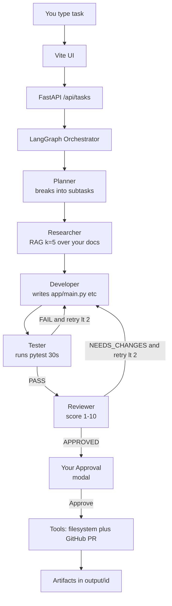
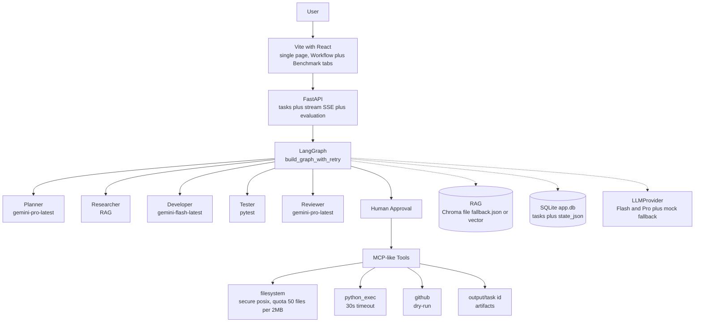
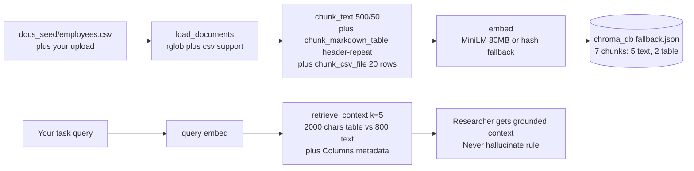

# ForgeMind Architecture — For Users Who Build

> **For users, not readers.** This doc explains how to *use* ForgeMind today, how it works under the hood, and when to scale it. For the story (why we built it, what makes it different) see `README.md`. For the growth plan (Docker, pgvector, more agents) see [`upgrade.md`](./upgrade.md).

---

## Snapshot for Users

```text
You write: "Build REST API for employees with FastAPI + JWT"
ForgeMind does: Understand → Plan → Research (your docs/tables) → Generate code → Run pytest → Fix failures → Review → Wait for your approval → Create PR
```

One command, verifiable artifacts, no hand-waving.

---

## 1. How It Works (End-to-End for Users)

### The flow you experience



**What you see in UI (cool tones slate/sky/cyan):** `○` idle → `●` pulse cyan (active) → `✓` emerald (done) in vertical stepper `frontend/src/App.jsx:12`. Logs stream via SSE `GET /api/stream/{id}` `backend/main.py:46`, fallback to DB snapshot if you refresh.

### State that moves between agents `graph/state.py:8`

```python
state = {
  "task_id": "...",
  "user_request": "Build REST API...",
  "plan": {"tasks": [{"id":1,"title":"Design API",...}]},
  "research": {"findings": [...]},
  "code": {"files": [{"path":"app/main.py","content":"..."}]},
  "test_results": {"passed": true, "summary": "..."},
  "review": {"decision": "APPROVED", "score": 8},
  "retry_count": 0, "max_retries": 2,
  "artifacts": ["app/main.py", "tests/test_main.py"], "logs": []
}
```

Agents read and update this shared state via `StateGraph` `graph/workflow.py:83`. No magic - just conditional edges.

---

## 2. System Overview (What You Run)



**Why this stack on 6GB:** `Chroma` file `chroma_db/` (no server), `SQLite` file `./app.db` `backend/core/database.py:9` WAL mode, `Vite` 400MB vs `Next.js` 1GB, `MiniLM` 80MB or hash fallback `rag/embeddings.py:14`, global env no Docker (Docker Desktop needs 2GB). All env-driven `backend/core/config.py:11` `DATABASE_PATH/CHROMA_PATH/OUTPUT_PATH` so you can swap to server later without rewriting `graph/`.

---

## 3. RAG — Your Knowledge, Not Hallucination

For users who give tabular data (CSV, markdown tables):



- Markdown table `| id | name |` split with header repeated each chunk `rag/ingestion.py:46`
- CSV `id,name,email,role...` linearized `col: val | col: val` + markdown table + `Columns:` header `rag/ingestion.py:68`
- `docs_seed/employees.csv:1` + `employees_table.md:1` (10 rows) proof: `What is Alice Johnson salary?` returns `95000` with full row, not invented.
- Upload your own: `POST /api/rag/ingest` `backend/api/evaluation.py:49` (Benchmark tab) or drop `docs_seed/*.csv` then `python -m rag.ingestion`.

Anti-hallucination prompt `agents/prompts/researcher.md:27`: *Never hallucinate table values. If not in context, say not found.*

---

## 4. How to Use (For Users)

### Option A — Single Command (Primary) — One Cmd Runs All (Idempotent)

ForgeMind’s best one-cmd checks before downloading — if all pass it goes, if not it downloads. No repeated `pip install`.

```powershell
# From project root
powershell -ExecutionPolicy Bypass -File run.ps1
# Or double-click run.bat

# What run.ps1 does (check-before-download, never downgrades):
# 1) Env: if Test-Path .env else Copy-Item .env.example .env + warn if placeholder still (always)
# 2) Python deps: python tools/check_pydeps.py --gte (Version < required only) -> if OK skip pip, else pip install --no-deps <missing> (never uninstall/downgrade)
# 3) Node deps: Test-Path frontend/node_modules/react -> if OK skip npm, else npm ci --prefer-offline
# 4) RAG: Test-Path chroma_db/fallback.json + chunks>0 + newer than docs_seed -> if OK skip, else python -m rag.ingestion (7 chunks)
# 5) Backend: try Invoke-RestMethod http://localhost:8000/health -> if running skip, else Start-Process uvicorn + poll 15x2s + open http://localhost:8000/docs
# 6) Frontend: try Invoke-WebRequest http://localhost:5173 -> if running skip, else npm run dev + open http://localhost:5173
# Flags: -NoBrowser, -NoInstall (runner only: skip 2-4, just Env + backend/frontend) e.g. run.ps1 -NoInstall
```

> Then open `http://localhost:5173` Workflow tab (Benchmark tab for RAG upload). `run.ps1 -NoInstall` is runner-only for manual installs.

### Option B — Manual Step-by-Step (Alternative, 2 Terminals) — For Control

<details>
<summary>Click to expand manual 6 steps</summary>

```powershell
# 1. Env (global, no venv needed)
pip install -r requirements.txt
copy .env.example .env
# Add GOOGLE_API_KEY from Google AI Studio to .env for real Gemini, or leave empty for mock (same orchestration, zero cost)

# 2. Ingest your knowledge
python -m rag.ingestion
# ingestion now understands CSV/markdown tables with header repetition

# 3. Backend (terminal 1)
uvicorn backend.main:app --reload --port 8000
# -> http://localhost:8000   http://localhost:8000/docs  + http://localhost:8000/health

# 4. Frontend (terminal 2)
cd frontend; npm install; npm run dev
# -> http://localhost:5173   Workflow + Benchmark tabs, cool tones

# 5. Try in UI or curl
curl -X POST http://localhost:8000/api/tasks -H "Content-Type: application/json" -d "{\"request\":\"Build minimal FastAPI hello world with GET / and GET /health and pytest tests\"}"
# Stream: GET /api/stream/{task_id}  Approve: POST /api/tasks/{task_id}/approve {"decision":"approved"}

# 6. Quick check
python -c "from rag.retrieval import retrieve_context; print(retrieve_context('Alice Johnson salary')[:800])"
```

</details>

### Workflow for users

1. **Describe** in UI textarea or `POST /api/tasks` `request`
2. **Watch** stepper live `Understanding -> Researching (RAG) -> Generating -> Testing -> Review`
3. **Check** `Artifacts` grid (`app/main.py` etc.) and `Logs` `bg-slate-900` panel
4. **Approve** when `Human Approval Required` modal shows `Review: APPROVED score 8` -> `Approve & Create PR` triggers `tools/github.py:10` draft PR (dry-run if no `GITHUB_TOKEN`)
5. **Find** output in `output/{task_id}/` (gitignored) and `GET /api/tasks/{task_id}` state

### Adding your data

- **Tabular:** Drop `employees.csv` or markdown table into `docs_seed/` or use Benchmark tab `Upload CSV` -> `POST /api/rag/ingest` -> `GET /api/rag/stats` shows `table_chunks` 2 → 3
- **Tasks:** Add to `evaluation/dataset.json:1` or generate diverse `python evaluation/synthetic_generator.py --count 5` -> `synthetic_dataset.json`
- **Prompts:** Edit `agents/prompts/*.md:1` (version `1.0.0`, `tier: pro/flash`, `temperature`) — no code change, `loader.py:17` `@lru_cache` reloads

---

## 5. Detailed Project Structure (For Users Navigating)

ForgeMind keeps `agents/prompts/` flat and clean — no subdirs, no archive, 5 prompt files + loader. Every file has a single responsibility and env-driven swaps keep `graph/` intact when scaling.

```text
ForgeMind/
├── agents/
│   ├── __init__.py
│   └── prompts/                         # Clean, flat — edit prompts without Python
│       ├── README.md                    # Versioning rules (patch/minor/major), linter
│       ├── loader.py                    # @lru_cache(5) + _FALLBACK inline, safe render_prompt
│       ├── planner.md                   # id: planner, tier: pro, temp 0.2 — decomposes request
│       ├── researcher.md                # tier: flash, anti-hallucination tabular rule
│       ├── developer.md                 # tier: flash (retry→pro), <300 lines, app/main.py etc
│       ├── tester.md                    # tier: flash 0.1, pytest summary
│       └── reviewer.md                  # tier: pro, APPROVED/NEEDS_CHANGES score 1-10
│
├── graph/                               # Orchestration heart, not Gemini
│   ├── state.py                         # AgentState TypedDict total=False (task_id, plan, research, code, test_results, review, approval, retry_count, artifacts, logs)
│   ├── nodes.py                         # 5 nodes + human_approval + render_prompt (safe JSON braces) + fallback
│   └── workflow.py                      # build_graph_with_retry() — conditional edges tester→developer (FAIL and retry<2), reviewer→developer (NEEDS_CHANGES and retry<2), single ainvoke fix, developer_with_retry increments
│
├── rag/                                 # Grounded retrieval, table-aware, no hallucination
│   ├── ingestion.py                     # chunk_text 500/50, detect_markdown_tables, chunk_markdown_table header-repeat (20 rows), chunk_csv_file col:val linearization, load_documents .csv/.tsv/.md/.py, ingest() 7 chunks (5 text,2 table) fallback.json
│   ├── retrieval.py                     # retrieve_context(k=5) 2000 chars table vs 800 text, Columns metadata, get_retrieval_stats()
│   └── embeddings.py                    # MiniLM all-MiniLM-L6-v2 80MB lazy + hash fallback 384d, batched encode
│
├── backend/
│   ├── main.py                          # FastAPI ForgeMind 1.0.0, /health mock_mode, /api/stream SSE + snapshot fallback, mounts frontend/dist
│   ├── core/
│   │   ├── config.py                    # Settings model_config env_file=.env, DATABASE_PATH/CHROMA_PATH/OUTPUT_PATH env-driven
│   │   ├── llm.py                       # LLMProvider TASK_ROUTING planner/pro, MODEL_MAP pro/flash->latest, is_mock(), mock fallback, JSON extract
│   │   └── database.py                  # SQLite ./app.db WAL journal_mode, tasks(id,request,status,state_json) + checkpoints
│   └── api/
│       ├── tasks.py                     # POST /api/tasks BackgroundTasks + workflow.astream SSE queues{task_id}, GET /tasks, POST /approve (feedback stored), queue pop after done
│       └── evaluation.py                # GET /evaluation/results, /evaluation/dataset, /rag/stats, POST /rag/ingest (CSV/MD upload, re-ingest), GET /rag/query
│
├── tools/                               # MCP-like, secure, quota-aware
│   ├── filesystem.py                    # write_artifacts secure posix, commonpath, quota 50 files/2MB (200KB/file), allow .py/.csv/.tsv/.md/.json, as_posix
│   ├── python_exec.py                   # run_tests() subprocess pytest -q --tb=short 30s timeout + py_compile fallback (pip install commented for low-spec)
│   └── github.py                        # create_github_pr dry-run if no GITHUB_TOKEN, else PyGithub draft PR ai/task-{id[:8]}
│
├── frontend/                            # Cool tones slate/sky/cyan/emerald, Benchmark + Workflow
│   ├── index.html                       # ForgeMind title + meta description
│   ├── vite.config.js                   # proxy /api->8000
│   ├── package.json                     # forgemind-frontend 1.0.0, Vite 5, React 18, Tailwind 3
│   └── src/App.jsx                      # Stepper (planner..human_approval), SSE EventSource, HITL modal, Benchmark tab (table + RAG upload), RAG query test
│
├── evaluation/                          # Measured, not vibes
│   ├── dataset.json                     # 15 tasks (6 easy,7 medium,2 hard)
│   ├── synthetic_dataset.json           # 5 diverse via synthetic_generator (webhook, rate-limit, CSV, pagination)
│   ├── synthetic_generator.py           # 6 templates, --count, --llm flag stub, random.choice
│   ├── evaluator.py                     # evaluate_task() Latency 4.2s mock, file_score, success=passed and APPROVED, mock_mode via provider.is_mock()
│   ├── metrics.py                       # task_completion/test_pass/avg_latency
│   └── results.json                     # 15/15 100% mock (real 60-80% with Gemini)
│
├── docs_seed/                           # Your knowledge, RAG ground truth
│   ├── employees.csv                    # 10 rows id,name,email,role,department,salary (ground truth, no hallucination)
│   ├── employees_table.md               # same as markdown table + notes avg 97000
│   ├── fastapi_standards.md             # Pydantic v2, DI, async
│   ├── architecture_guidelines.md       # layers API→service→repo
│   ├── testing_strategy.md              # TestClient fixtures, self-correction max2
│   └── synthetic_example.md             # generated synthetic data
│
├── docs/                                # For users and growth
│   ├── architecture.md                  # this file — for users who build (how it works, how to use)
│   ├── upgrade.md                       # file→server recipes, thresholds, upgraded flowchart
│   ├── tabular_rag.md                   # header repetition detail + anti-hallucination
│   ├── decisions.md                     # LangGraph>CrewAI, Chroma file>pgvector, SQLite>Postgres etc.
│   ├── security.md                      # traversal block, HITL gate, quotas
│   └── evaluation.md                    # benchmark pipeline
│
├── tests/
│   ├── test_workflow.py                 # mock workflow, llm, filesystem, retrieval
│   ├── test_tools.py                    # run_tests no_dir/empty
│   └── test_tabular_rag.py              # markdown tables, csv chunk, retrieval preserves Alice 95000
│
├── .env.example                         # GOOGLE_API_KEY, GITHUB_TOKEN, DATABASE_PATH etc.
├── requirements.txt                     # pinned low-RAM versions
└── output/                              # artifacts per task_id (gitignored, .gitkeep)
```

---

## 6. When to Scale (For Users Growing)

You built on file mode to prove orchestration on 6GB. When data or requirements grow, **ForgeMind scales with one env-var + one file**, keep `graph/` intact. See [`upgrade.md`](./upgrade.md) for full matrix.

**Quick triggers (resume-interesting):**
- `<100 docs` fallback keyword fine → `100-1k` need real MiniLM → `>10k` need `pgvector` `pip install pgvector` `CHROMA_PATH=postgres://`
- `SQLite WAL` fine for 15 tasks `4.2s` → `>100 req/s` → `Postgres+Redis` `DATABASE_PATH=postgres://`
- `6GB` no Docker → `>8GB` → `Dockerfile python:3.11-slim` `compose`

Full upgraded flowchart and thresholds in `upgrade.md` — the upgrade-type plan you asked for, paraphrased from MASTER_PLAN but for ForgeMind 1.0→2.0.

---

## 7. Limitations for Users

- `5 agents` (planner/researcher/developer/tester/reviewer) — add `architect/security/docs` via 1 md + 2 edges `graph/workflow.py:83` when needed
- `50 files/2MB` quota `tools/filesystem.py:10`, `30s` pytest `tools/python_exec.py:30`, global env not isolated
- Free tier `5 RPM` `gemini-flash-latest` → 1 task/min real, mock for 15-task speed

For decisions why these limits, see `docs/decisions.md:1`. For security, see `docs/security.md:1`.

---

*Built for users who want to verify, not just prompt. See `README.md` for the story that makes people read.*
