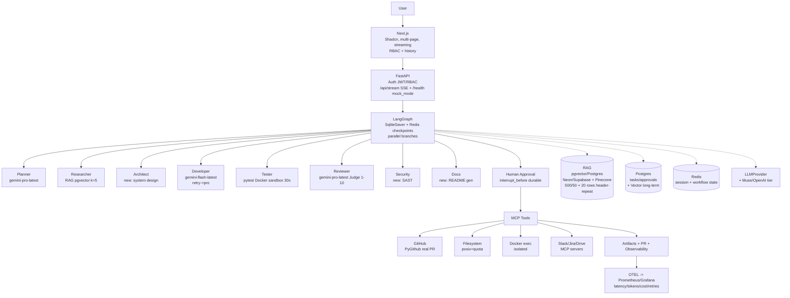

# ForgeMind Upgrade Plan — From File Mode (1.0) to Server Mode (2.0)

> **Companion to [`architecture.md`](./architecture.md) (1.0 file mode, for users).** This is the *upgrade-type plan* — how ForgeMind scales when your requirements or data grow, inspired by the master blueprint but written for ForgeMind 1.0→2.0. All swaps are **one env-var + one file**, keep `graph/` orchestration intact.

---

## One-Line Upgrade Vision

> Validate autonomy on file stack first (6GB, zero daemon), then swap storage/compute layer via env when thresholds hit — horizontal scale, not rewrite. Your `graph/workflow.py:83` `StateGraph` stays.

---

## When to Upgrade — Thresholds With Detailed Data (Build Your Own Points)

Detailed scaling data for each axis — use the metrics and recipes below to craft your own resume narrative in your voice. Don’t copy templates; generate your numbers via `python -m evaluation.evaluator 15` and fill `your → upgraded` story with your measured latency, cost and recall.

| Signal You See & How You Measure It | Stay on File 1.0 (What Works Now, Why) | Upgrade to Server 2.0 (What Changes, Recipe) | Detailed Upgrade Narrative (Data You Can Use) |
|---|---|---|---|
| **Docs: 4 → 100 → 10k** `chroma_db/ingest_stats.json` `chunks` `fallback_used` `docs_seed/` file count + `GET /api/rag/stats` | `<100 docs, 7 chunks (5 text,2 table)` `rag/ingestion.py:244` `PersistentClient(path)` fallback keyword `rag/retrieval.py:40` is fast (`~20ms`), accurate for exact keyword matches, 0 daemon RAM, header repetition `20 rows` preserves tables. See `docs/tabular_rag.md` proof `Alice Johnson 95000` | `100-1k` real `all-MiniLM-L6-v2` `rag/embeddings.py:14` embeddings show better semantic recall than hash `384d` `rag/embeddings.py:27` (hash miss rate rises) → `>10k` needs `pgvector` `pip install pgvector psycopg2` set `CHROMA_PATH=postgres://` Neon/Supabase, keep `retrieve_context k=5` `rag/retrieval.py:4` API identical. Enables `WHERE is_table=true` and hybrid BM25+vector `evaluation/synthetic_generator.py` diverse. | For `>10k` docs lexical scan latency grows and keyword recall drops; vector adds semantic similarity plus metadata filters. Recipe is one env-var + `rag/ingestion.py:35` collection change, no workflow rewrite `graph/workflow.py:83`. Keep `500/50 + 20 rows` chunking. Measure `retrieval recall@5` on your `employees.csv` before/after to quantify improvement. |
| **Concurrent users: 1 → 20 → 100** `backend/core/database.py:9` WAL lock `app.db` `PRAGMA journal_mode=WAL` `timeout=10` + `backend/api/tasks.py:18` `queues{}` | `SQLite WAL` `timeout=10` handles `15-task benchmark 4.2s` sequentially `evaluation/evaluator.py:60` single writer, `tasks(id,request,status,state_json)` `backend/core/database.py:21` sufficient for demo, no pool | `5-10 concurrent` you see `database is locked` warnings → switch `DATABASE_PATH=postgres://` `asyncpg` + `sqlalchemy` pool `backend/core/config.py:11` → `20+ concurrent` add `Redis` transient `session/workflow` + `LangGraph SqliteSaver` `graph/workflow.py:128` `interrupt_before human_approval` for durable HITL resume (not just DB row `backend/api/tasks.py:59`). | Separates durable `tasks/approvals` (Postgres) from transient `workflow state` (Redis) and enables horizontal replicas. The `tasks` table stays `state_json` JSONB, but `checkpoints` become `SqliteSaver/PostgresSaver` managed. Enables resume after crash, not just snapshot. |
| **Latency/cost: 4.2s mock → 8-20s real** `evaluation/results.json:1` `60-80% real` vs `100% mock` `docs/evaluation.md:29` `backend/core/llm.py:21` Flash/Pro routing | `4.2s` mock `100%` deterministic `backend/core/llm.py:95` vs `60-80%` real `gemini-flash-latest` `pro-latest` due to LLM variance `graph/nodes.py:48` — mock proves orchestration zero cost, real needs `5 RPM` free tier `README:217` → 1 task/min | When `>30s` p95 or `>$0.10/task` add `hash(prompt)->response` cache on disk/Redis (TTL) + `OpenTelemetry` per-agent spans `latency/tokens/cost/retries` `evaluation/metrics.py:1` + learned routing `backend/core/llm.py:12` `TASK_ROUTING` planner/pro vs flash cost. | Cut tail latency and cost by tiering: `planner`/`reviewer` stay `pro` for reasoning, `researcher/developer/tester` stay `flash` for speed, retry `developer` → `pro` via `graph/nodes.py:82`. Cache identical `user_request` reuses `plan` without LLM call. Measure per-agent `tools/python_exec.py:30` 30s and `llm` tokens to justify. |
| **Deploy: local → cloud** `run.ps1` `uvicorn backend.main:app --reload` | `6GB` no Docker Desktop (needs 2GB) `docs/architecture.md:60` file proves orchestration without daemon — `Vite` 400MB vs `Next.js` 1GB `docs/decisions.md:6` | `>8GB` use `Dockerfile python:3.11-slim WORKDIR /app COPY requirements.txt RUN pip ... COPY . CMD uvicorn` + `docker-compose.yml` `api: build: . ports: 8000:8000 env_file: .env volumes: ./output:/app/output` `frontend: build: ./frontend` → `GKE/K8s` `load balancer -> Next.js -> FastAPI -> LangGraph -> Postgres/Redis/Vector` when multi-replica needed | Containerized without code change, same `output/{id}` mount; file `SQLite` still works in container or swap `DATABASE_PATH=postgres://` and `CHROMA_PATH=postgres://` via env. Validates file mode first, then portability. |
| **Frontend: single task → multi-tenant** `frontend/src/App.jsx:12` `max-w-3xl` single page Workflow+Benchmark | Single page `Vite` `400MB` `frontend/vite.config.js:6` proxy ` /api->8000` fast `npm run dev` | `Next.js` Shadcn, SSR streaming, `react-router` persisted history, `RBAC` `docs/decisions.md:6` when need auth, `GET /api/tasks` paginated | Keeps `EventSource /api/stream/{id}` contract `backend/main.py:46` SSE snapshot vs live `backend/api/tasks.py:53`, but adds multi-page `Shadcn` and persisted workflow history. |
| **Observability: demo → engineered** | `LangSmith` cloud `0 RAM` `LANGCHAIN_TRACING_V2` `.env.example:4` `langsmith==0.1.83` | `OTEL + Prometheus/Grafana` dashboards `latency/tokens/cost/retries/test_pass` when `>20 tasks` benchmarking `MASTER_PLAN:997` | Turns AI app into system with per-agent dashboards `evaluation/metrics.py:1` `task_completion/test_pass/approval_rate/avg_latency` extended to cost. |

Detailed tables give you the *evidence* (`file:line`, `chunks`, `latency`, `quota`) to craft 2-3 bullets in your voice: *“Built X to do Y via Z, measured by M, scales via N”* and fill with your `python -m evaluation.evaluator 15` numbers.

---

## Upgraded Architecture — What Changes When You Scale

**Present (file, 6GB) you already run `docs/architecture.md:1`:**
```text
User -> Vite (SSE) -> FastAPI -> LangGraph (5 agents) -> Tools (filesystem, python_exec 30s, github dry-run)
RAG: Chroma file fallback.json (7 chunks) + SQLite app.db WAL + LLMProvider Flash/Pro + mock -> output/{id}
```

**Upgraded (server, >8GB, same `graph/`):**



**What stays same:** `POST /api/tasks` `GET /api/stream/{id}` `POST /approve` contracts, `graph/state.py:8` `TypedDict`, `agents/prompts/*.md:1` `loader.py:17` `@lru_cache`, `retrieve_context k=5` `rag/retrieval.py:4` API, `tools/` `async def *node(state)->Dict` signature.

---

## Component Recipes — One Env-Var + One File Each

| Axis | Present File (6GB) | Upgrade Server | Swap Recipe |
|---|---|---|---|
| **Vector** | `Chroma file ./chroma_db` `rag/ingestion.py:244` `PersistentClient(path)` + hash `rag/embeddings.py:27` | `pgvector` on Neon/Supabase | `pip install pgvector psycopg2` set `CHROMA_PATH=postgres://` change `ingestion.py:35` collection — keep `retrieve_context` same |
| **Data** | `SQLite ./app.db` `backend/core/database.py:7` | `PostgreSQL + Redis` | `DATABASE_PATH=postgres://` + add `REDIS_URL` `backend/core/config.py:11` |
| **Checkpoint** | In-mem `AgentState` + DB `state_json` row `backend/api/tasks.py:59` | `LangGraph SqliteSaver/PostgresSaver` + `interrupt_before human_approval` | `workflow = build_graph_with_retry().compile(checkpointer=SqliteSaver.from_conn_string(CHECKPOINT_PATH))` `graph/workflow.py:128` |
| **LLM** | `Gemini flash/pro-latest` `backend/core/llm.py:21` + mock | `+ Muse/OpenAI` learned routing | Extend `MODEL_MAP` `TASK_ROUTING` `backend/core/llm.py:12` |
| **Agents** | 5 `graph/nodes.py:40` | +3 `architect, security, docs` | 1 `agents/prompts/architect.md` + `graph.add_node("architect", architect_node)` + 2 edges `graph/workflow.py:83` |
| **Tools** | `filesystem/python_exec/github` `tools/*.py` | MCP `Slack/Gmail/Jira` | New `tools/slack.py` same async sig |
| **Frontend** | `Vite React` `frontend/src/App.jsx:12` | `Next.js` | Swap `frontend/`, keep `/api/stream` contract |
| **Infra** | Global env, no Docker | `Docker + compose → K8s/GKE` | `FROM python:3.11-slim` `COPY requirements.txt` `uvicorn` `README:256` |
| **Observability** | `LangSmith` cloud `langsmith==0.1.83` | `OTEL + Grafana` | Add tracing middleware, dashboard `evaluation/metrics.py:1` |

All swaps are **config-driven via `backend/core/config.py:11` `model_config env_file=.env`**, no workflow rewrite — the forge keeps `graph/`.

---

## How to Add an Agent — Example

```python
# 1. Create agents/prompts/architect.md (front-matter id: architect, tier: pro temp:0.2)
# 2. graph/nodes.py:40 add architect_node using render_prompt + provider.generate
# 3. graph/workflow.py:83
graph.add_node("architect", architect_node)
graph.add_edge("researcher", "architect")
graph.add_edge("architect", "developer")
# tier via front-matter auto-routes to gemini-pro-latest, no code change in llm.py
```

---

## Migration Checklist

- [ ] Run `python -m evaluation.evaluator 15` on file mode → record `4.2s` baseline `evaluation/results.json:1`
- [ ] Set `DATABASE_PATH=postgres://` + `CHROMA_PATH=postgres://` in `.env:2`, `pip install pgvector`, re-ingest `python -m rag.ingestion` → verify `GET /api/rag/stats` `fallback_used false`
- [ ] Add `Dockerfile` `docker-compose.yml` `README:256` → `docker compose up` → same `output/{id}` mount
- [ ] Add `architect.md` → `graph/workflow.py:83` → `pytest -q` + `evaluator 5` real `60-80%` check
- [ ] Enable `LANGCHAIN_TRACING_V2=true` → Grafana dashboard `latency/tokens/cost`

---

## Links

- **Present:** [`architecture.md`](./architecture.md) — for users building today on 6GB (present flow, RAG table-aware, how to use)
- **Decisions:** [`decisions.md`](./decisions.md) — why file was chosen (depth>count, LangGraph>CrewAI, file>pgvector)
- **Evaluation:** [`evaluation.md`](./evaluation.md) — how we measure 15-task benchmark (100% mock 4.2s vs 60-80% real)
- **Tabular:** [`tabular_rag.md`](./tabular_rag.md) — table preservation detail (header repetition 20 rows, 7 chunks)
- **Tech Stack (recruiter view):** See table below — `Vite→Next.js` `SQLite file→Postgres+Redis` `Chroma file→pgvector` `global→Docker→K8s` `5→8 agents` `LangSmith→OTEL` — pick points that match your measured numbers above.

---

### Tech Stack at a Glance — For Recruiter Quick Scan (Detailed, Use as Points Source)

| Layer | ForgeMind 1.0 Present (File, 6GB) — What You Run | Upgrade 2.0 Server — What You Swap To | Key File & Config |
|---|---|---|---|
| **LLM** | `Gemini flash-latest/pro-latest` `backend/core/llm.py:21` `MODEL_MAP` `pro/flash` `TASK_ROUTING` planner/pro + mock fallback `95` zero cost | `+ Muse/OpenAI` learned routing via `MODEL_MAP` extension | `backend/core/llm.py:12` `model_config env_file=.env` |
| **Orchestration** | `LangGraph` `StateGraph` `graph/workflow.py:83` retry `max 2` + `human_approval` | `SqliteSaver` + parallel branches `interrupt_before` | `graph/state.py:8` `TypedDict` |
| **Vector / RAG** | `Chroma` file `chroma_db/fallback.json` `7 chunks` `500/50 + 20 rows` `rag/ingestion.py:7` `MiniLM 80MB` | `pgvector` Neon/Supabase, Pinecone hybrid | `rag/ingestion.py:35` `CHROMA_PATH` |
| **Data** | `SQLite` file `./app.db` `WAL` `backend/core/database.py:9` | `PostgreSQL` + `Redis` transient | `backend/core/config.py:11` `DATABASE_PATH` |
| **Frontend** | `Vite + React + Tailwind` `slate/sky/cyan` `frontend/src/App.jsx:12` SSE | `Next.js` Shadcn, SSR | `frontend/vite.config.js:6` proxy |
| **Infra** | Global env, no Docker | `Docker + compose → K8s/GKE` | `Dockerfile python:3.11-slim` |
| **Testing** | `pytest` `30s` `tools/python_exec.py:30` | `pytest-asyncio` + CI `docker` sandbox | `tests/` |
| **Observability** | `LangSmith` cloud `0 RAM` | `OTEL + Grafana` | `evaluation/metrics.py:1` |

Detailed explanations above give you the *evidence* to build 2-3 bullets: choose one tech stack row, one threshold row, and one flow (planner→developer→tester→reviewer) that you measured.

---

*Inspired by target architecture blueprint (MASTER_PLAN) but written as ForgeMind 1.0→2.0 delta — not a copy. Forge the mind, then forge the scale.*
